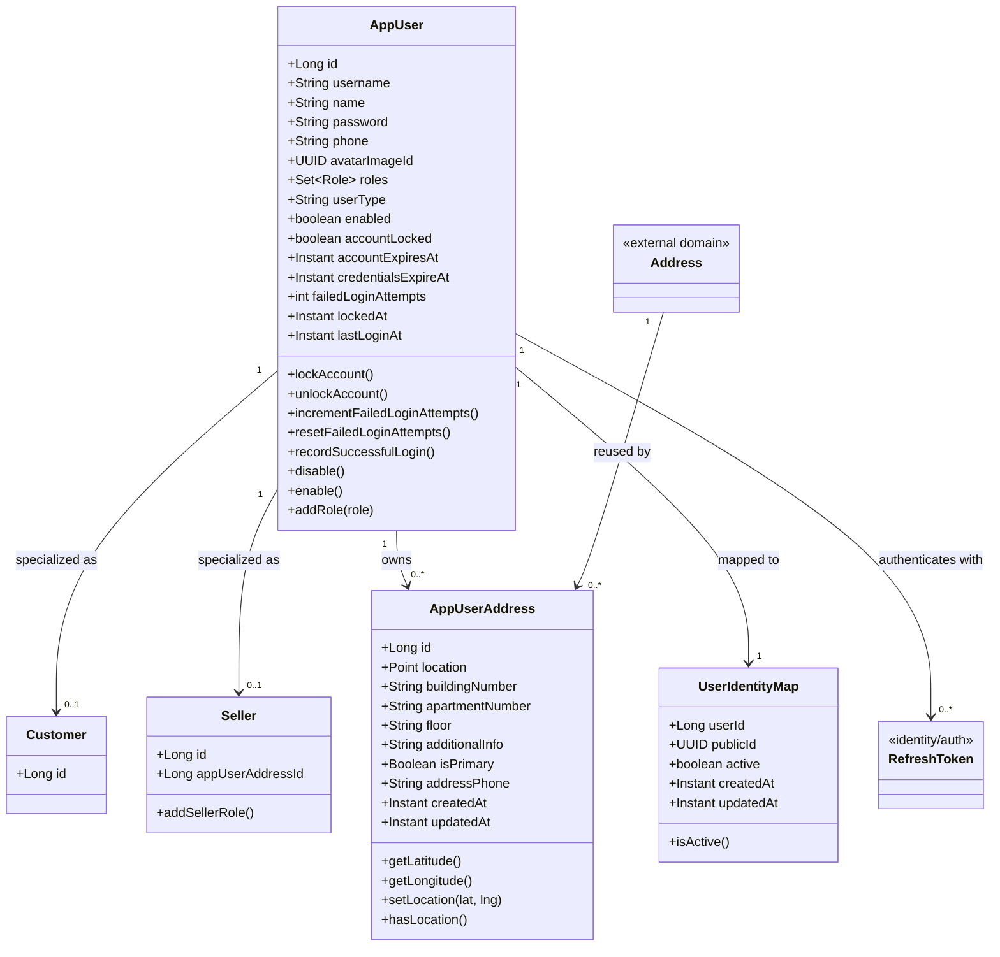
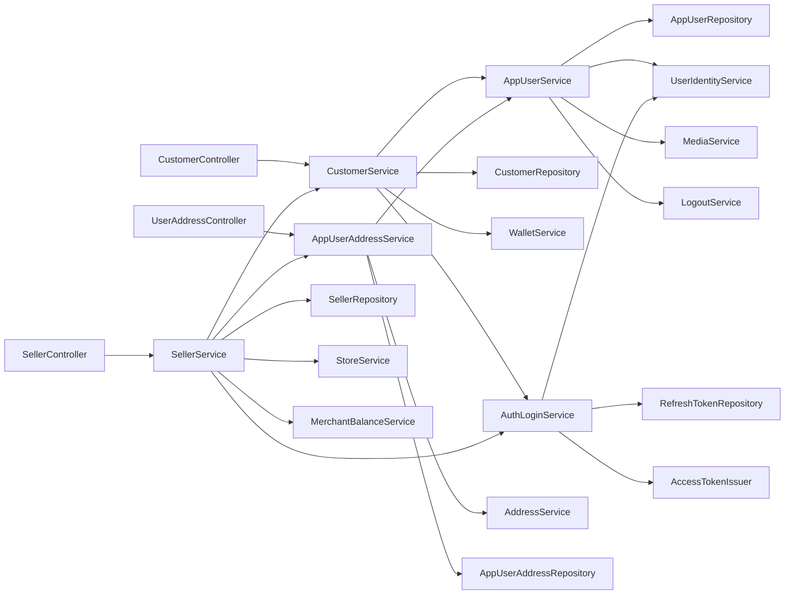
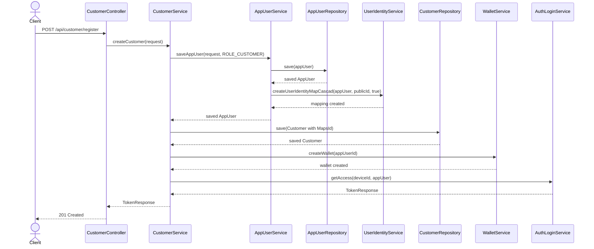
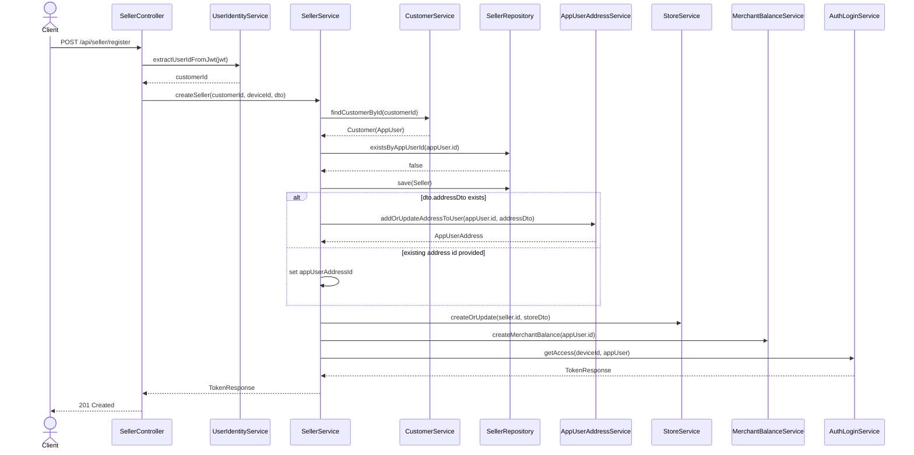
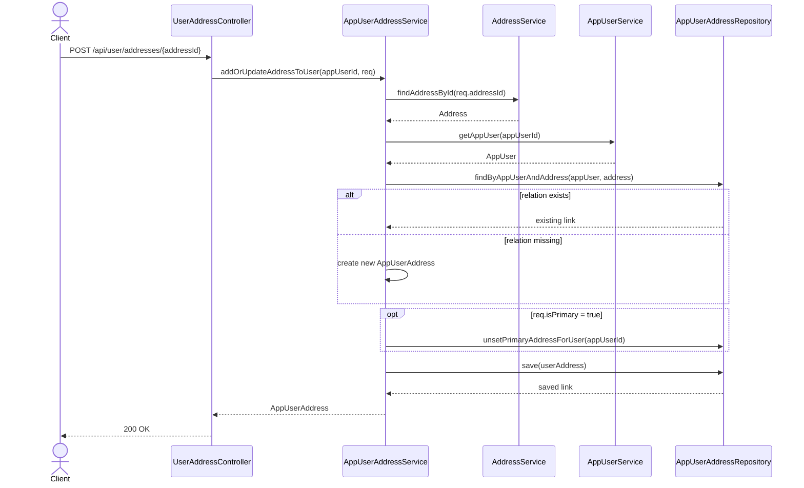
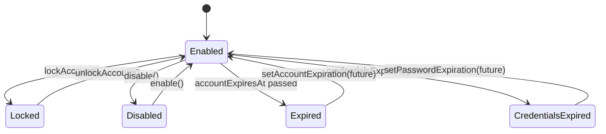
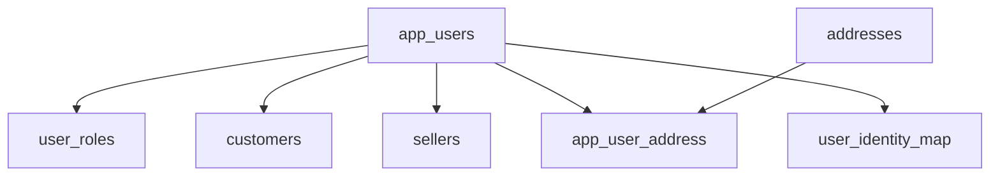

# App User UML

## Class Diagram

## Service Dependency Diagram

## Customer Registration Sequence

## Seller Upgrade Sequence

## User Address Management Sequence

## State Diagram For Account Status

## ER-Style Relationship View

