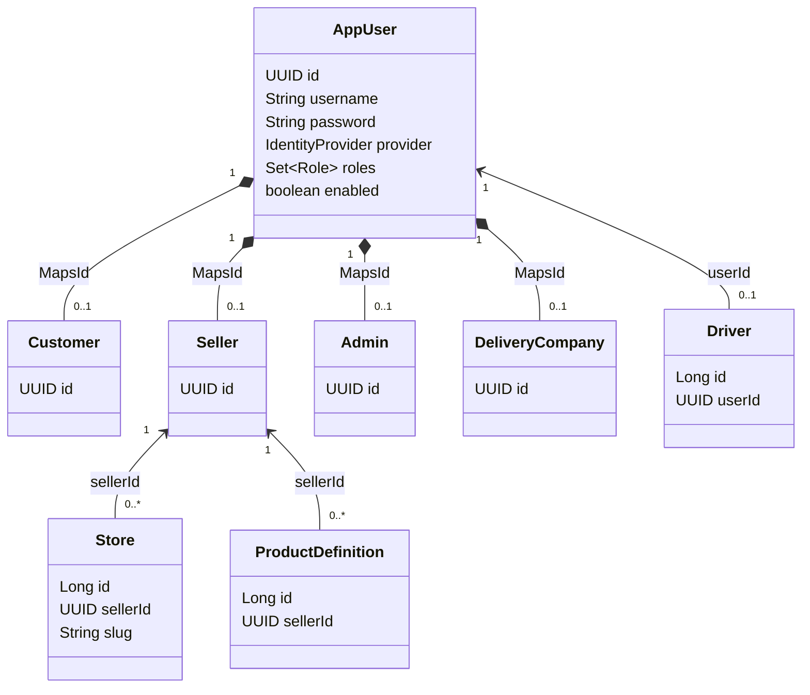
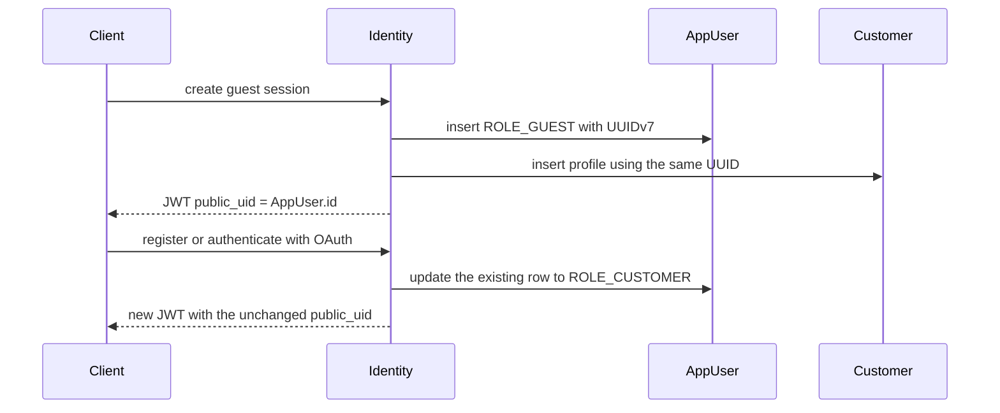
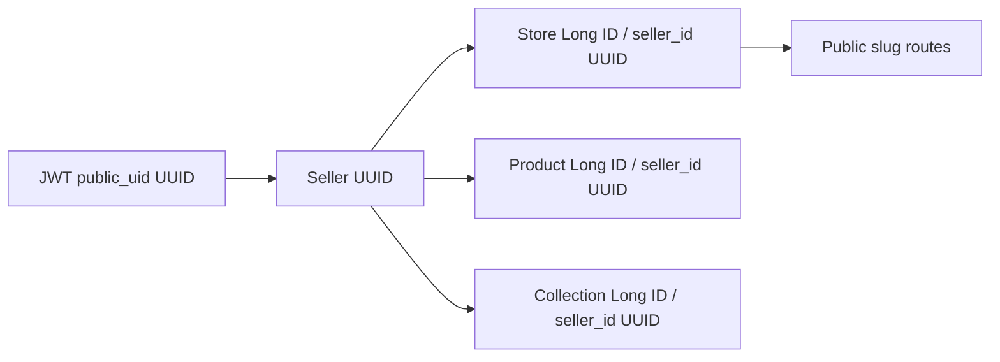

# App User UML

## Domain Model

```mermaid
classDiagram
    class AppUser {
        UUID id
        String username
        String password
        IdentityProvider provider
        Set~Role~ roles
        boolean enabled
    }
    class Customer { UUID id }
    class Seller { UUID id }
    class Admin { UUID id }
    class DeliveryCompany { UUID id }
    class Driver {
        Long id
        UUID userId
    }
    class Store {
        Long id
        UUID sellerId
        String slug
    }
    class ProductDefinition {
        Long id
        UUID sellerId
    }

    AppUser "1" *-- "0..1" Customer : MapsId
    AppUser "1" *-- "0..1" Seller : MapsId
    AppUser "1" *-- "0..1" Admin : MapsId
    AppUser "1" *-- "0..1" DeliveryCompany : MapsId
    AppUser "1" <-- "0..1" Driver : userId
    Seller "1" <-- "0..*" Store : sellerId
    Seller "1" <-- "0..*" ProductDefinition : sellerId
```

## Guest Upgrade

```mermaid
sequenceDiagram
    participant Client
    participant Identity
    participant AppUser
    participant Customer

    Client->>Identity: create guest session
    Identity->>AppUser: insert ROLE_GUEST with UUIDv7
    Identity->>Customer: insert profile using the same UUID
    Identity-->>Client: JWT public_uid = AppUser.id
    Client->>Identity: register or authenticate with OAuth
    Identity->>AppUser: update the existing row to ROLE_CUSTOMER
    Identity-->>Client: new JWT with the unchanged public_uid
```

## Storefront Ownership

```mermaid
flowchart LR
    JWT[JWT public_uid UUID] --> Seller[Seller UUID]
    Seller --> Store[Store Long ID / seller_id UUID]
    Seller --> Product[Product Long ID / seller_id UUID]
    Seller --> Collection[Collection Long ID / seller_id UUID]
    Store --> Slug[Public slug routes]
```
