# Product UML

## Class Diagram

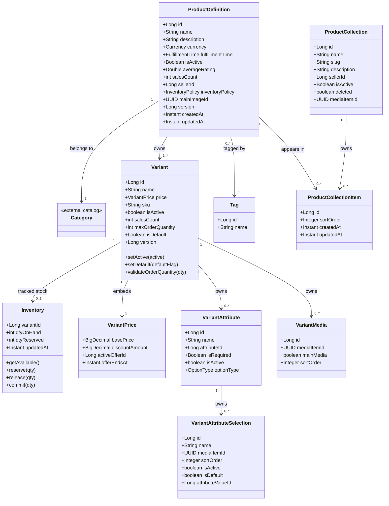

## Service Dependency Diagram

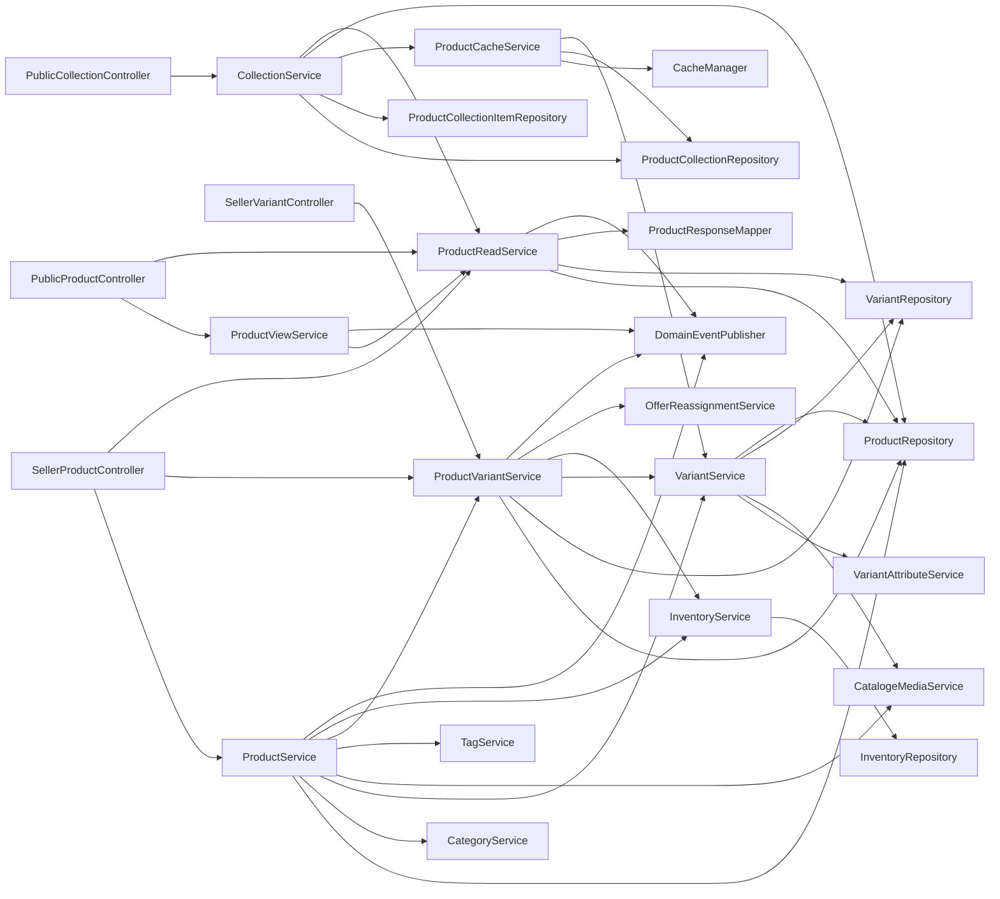

## Product Creation Sequence

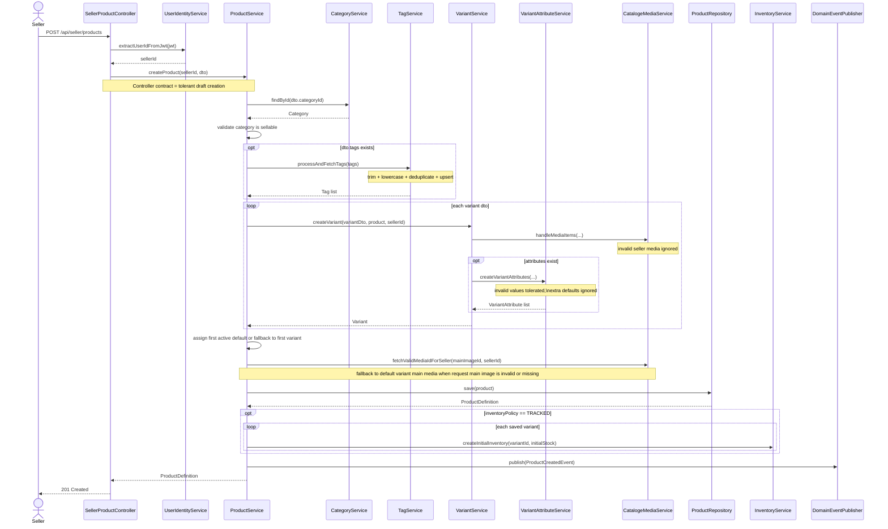

## Create Product Activity Diagram

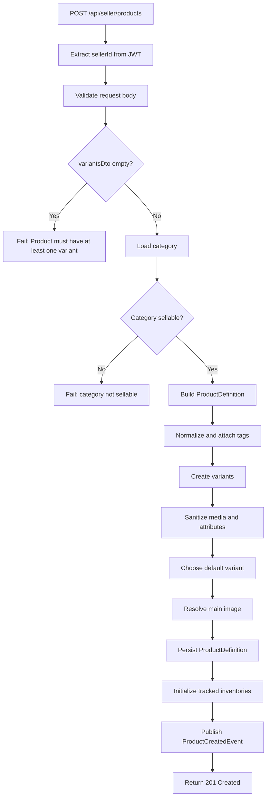

## Tolerant Creation Rules

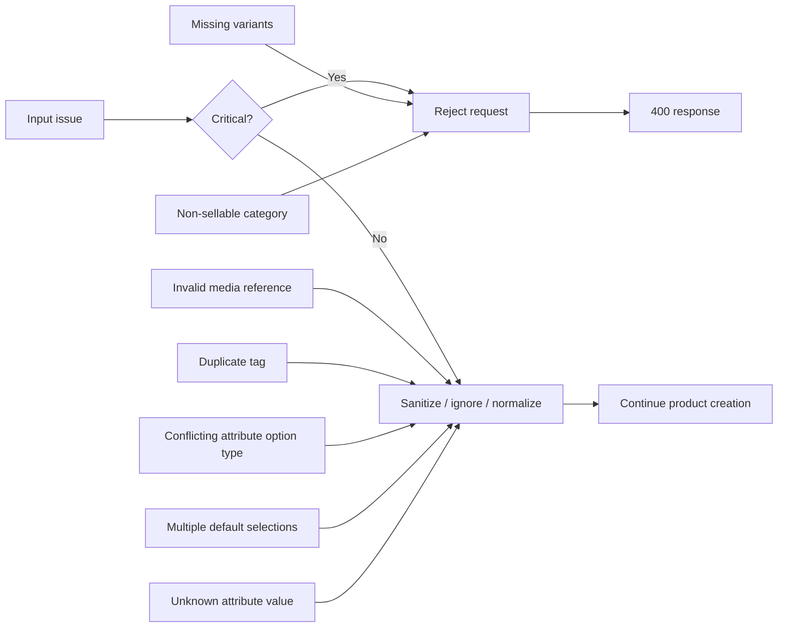

## Variant Lifecycle Sequence

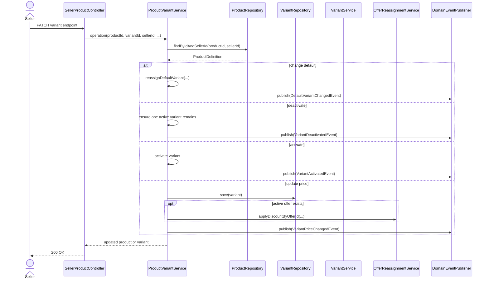

## Inventory Reservation Rules

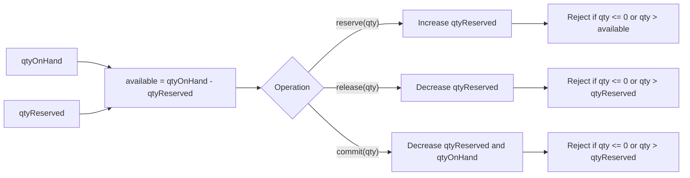

## Public Product Read Sequence

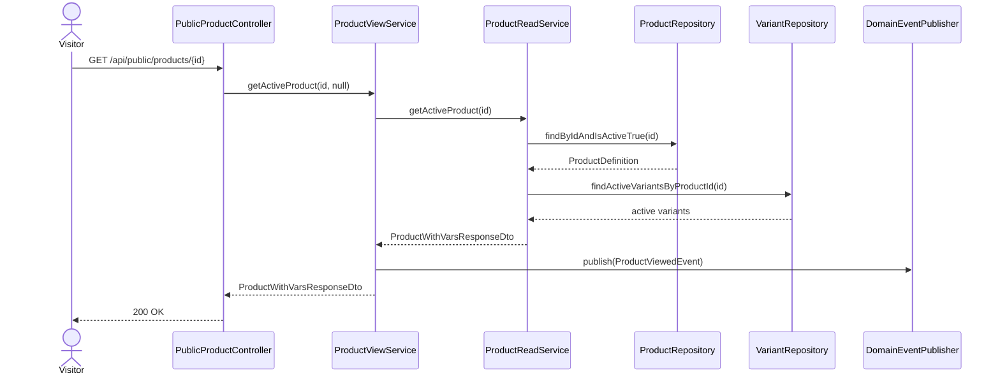

## Collection Rendering Sequence

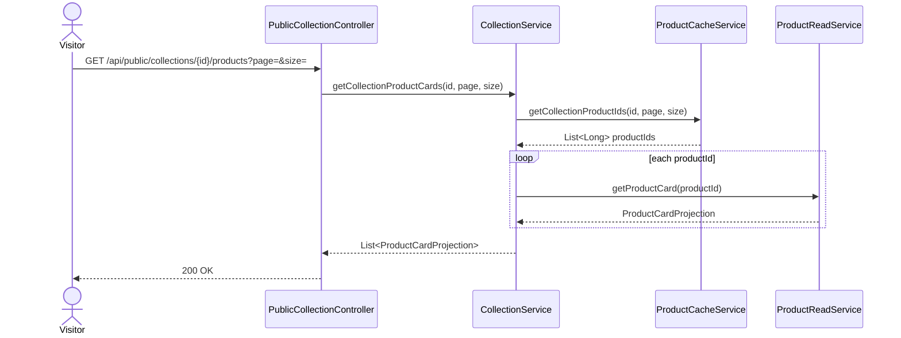

## Product State Diagram

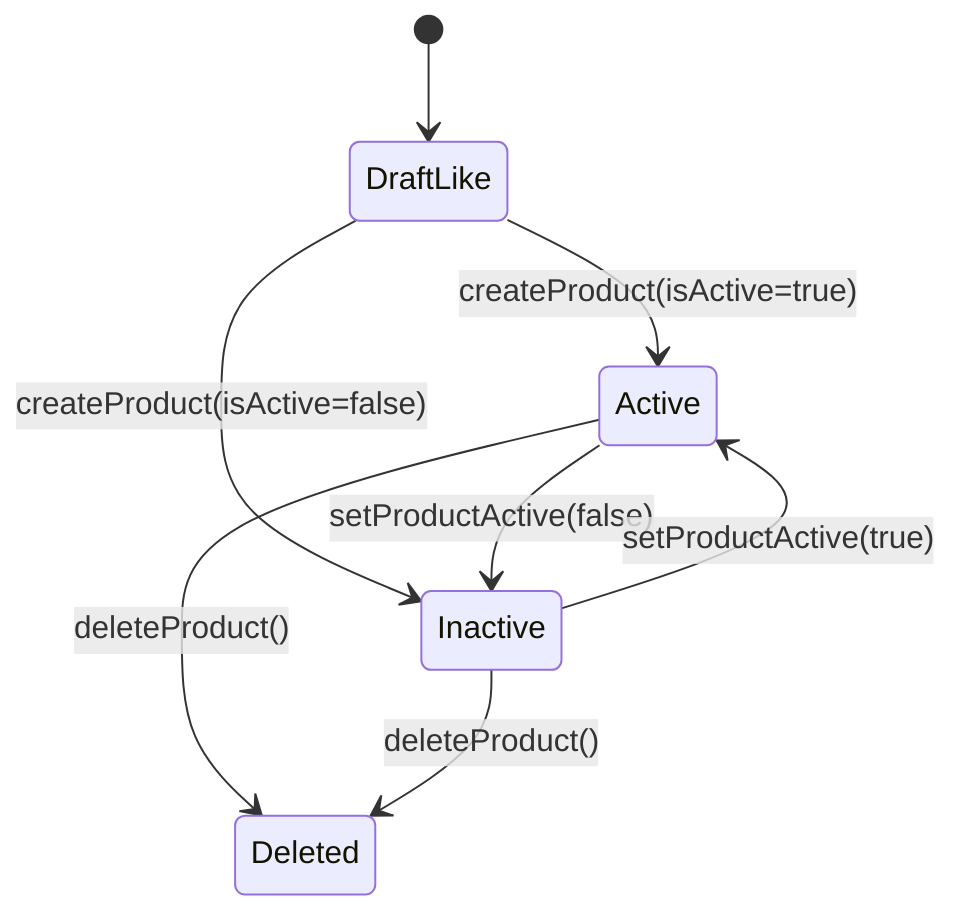

## Variant Invariant Diagram

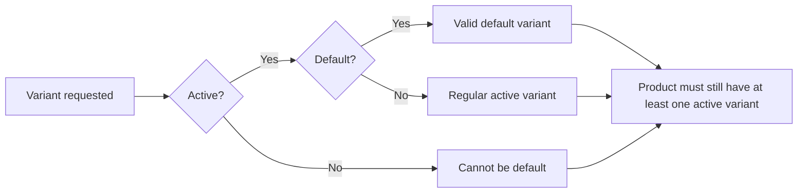
