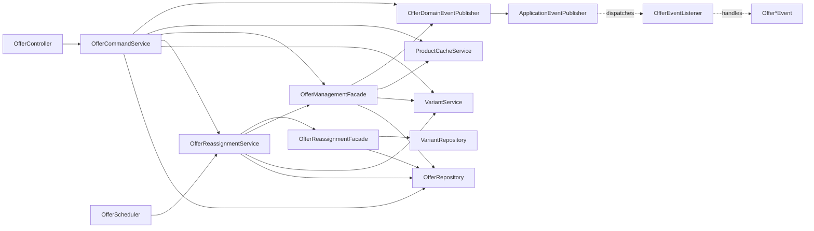
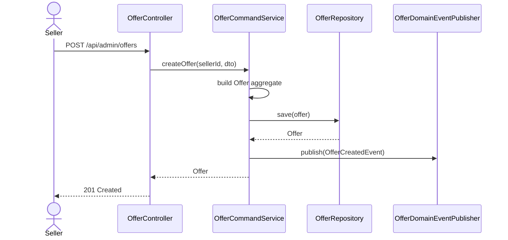
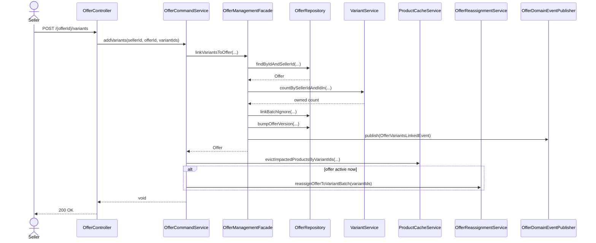
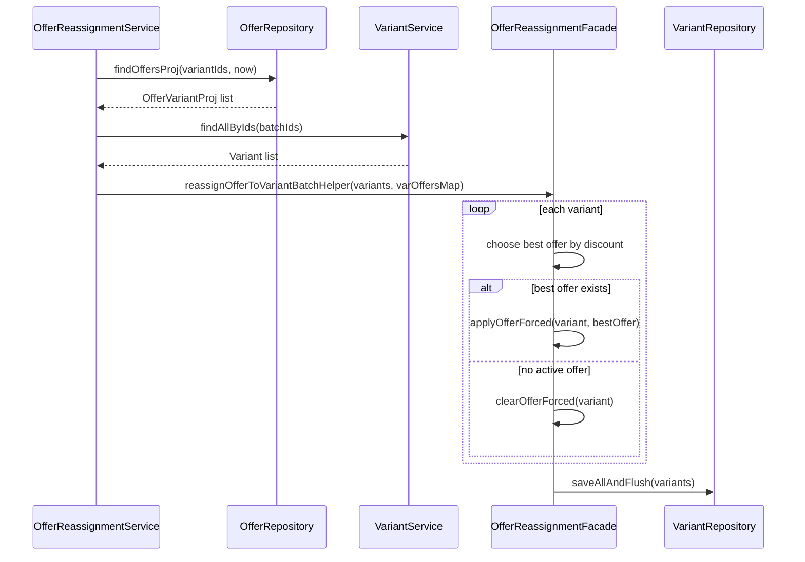
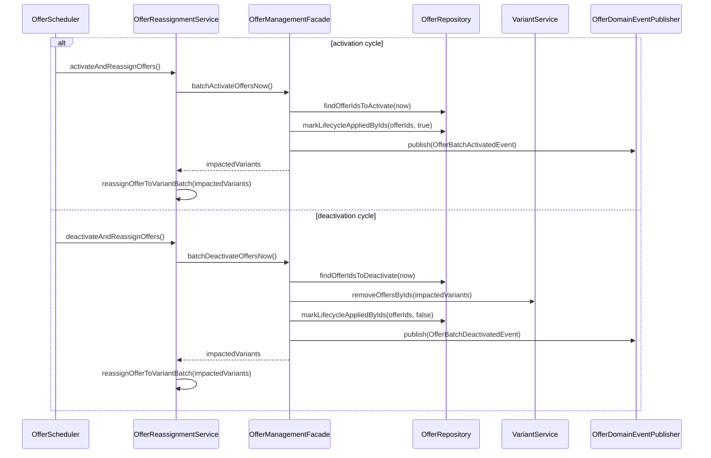
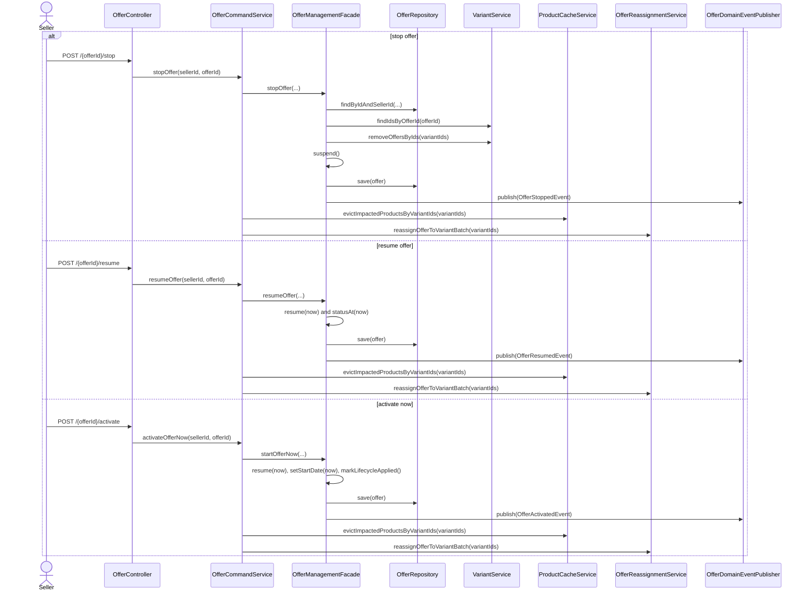
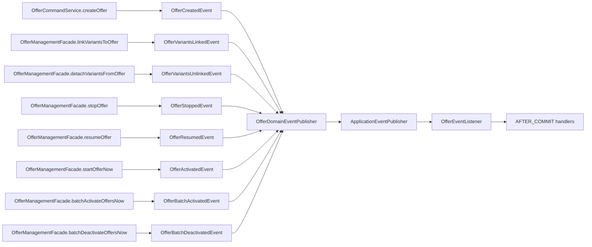
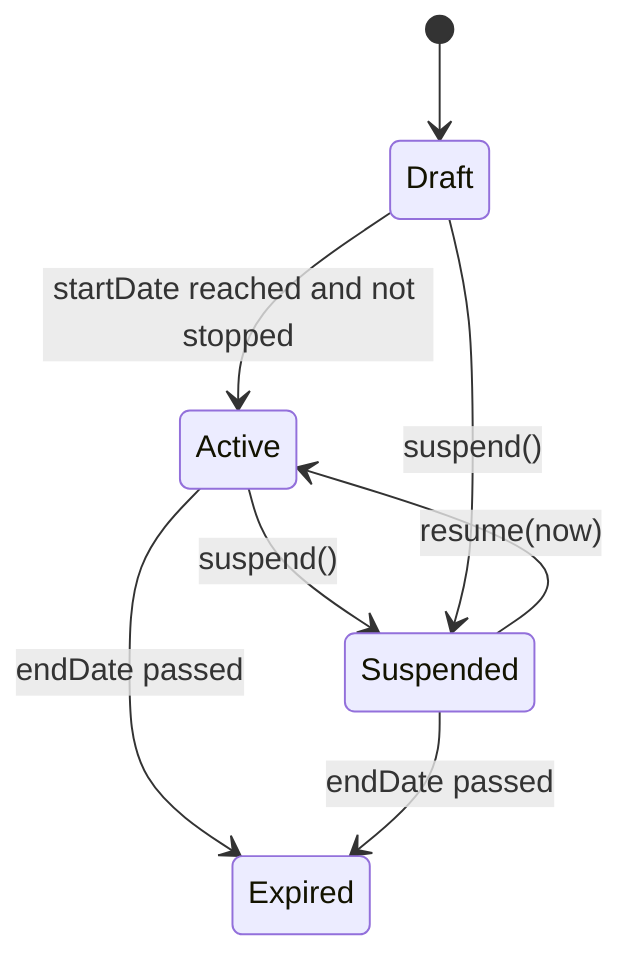
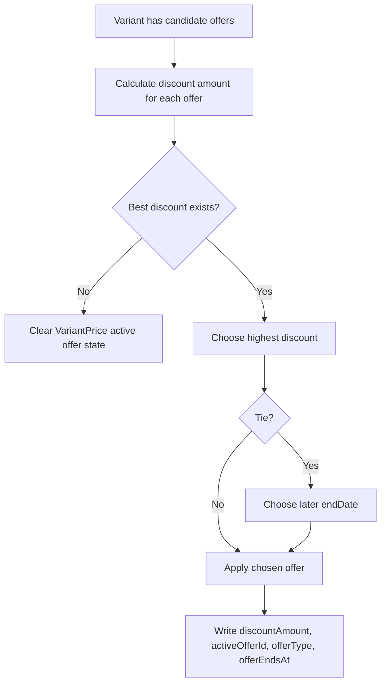

# Offer UML

## Class Diagram

```mermaid
classDiagram
    class Offer {
        +Long id
        +String name
        +String description
        +OfferType offerType
        +BigDecimal discountValue
        +Instant startDate
        +Instant endDate
        +Boolean isStopped
        +boolean isLifecycleApplied
        +Long sellerId
        +Long version
        +statusAt(now)
        +suspend()
        +resume(now)
        +canActivate(now)
        +canResume(now)
        +markLifecycleApplied()
        +markLifecycleDeactivated()
    }

    class OfferType {
        <<enum>>
        PERCENTAGE
    }

    class OfferStatus {
        <<enum>>
        DRAFT
        ACTIVE
        SUSPENDED
        EXPIRED
    }

    class OfferVariantProj {
        +Long variantId
        +Long offerId
        +OfferType offerType
        +BigDecimal discountValue
        +Instant startDate
        +Instant endDate
        +Boolean isStopped
    }

    class Variant {
        +Long id
        +VariantPrice price
    }

    class VariantPrice {
        +BigDecimal basePrice
        +BigDecimal discountAmount
        +Long activeOfferId
        +OfferType offerType
        +Instant offerEndsAt
    }

    class OfferCalculator {
        +calculateDiscountAmount(type, basePrice, discountValue)
    }

    class OfferDomainEvent {
        <<interface>>
    }

    class OfferDomainEventPublisher {
        +publish(event)
    }

    class OfferEventListener {
        +handleOfferCreated(event)
        +handleOfferVariantsLinked(event)
        +handleOfferVariantsUnlinked(event)
        +handleOfferStopped(event)
        +handleOfferResumed(event)
        +handleOfferActivated(event)
        +handleOfferBatchActivated(event)
        +handleOfferBatchDeactivated(event)
    }

    class OfferCreatedEvent {
        +Long offerId
        +String offerName
        +Long sellerId
        +OfferType offerType
        +BigDecimal discountValue
    }

    class OfferVariantsLinkedEvent {
        +Long offerId
        +Long sellerId
        +Set~Long~ variantIds
    }

    class OfferVariantsUnlinkedEvent {
        +Long offerId
        +Long sellerId
        +Set~Long~ variantIds
    }

    class OfferStoppedEvent {
        +Long offerId
        +Long sellerId
        +Set~Long~ variantIds
    }

    class OfferResumedEvent {
        +Long offerId
        +Long sellerId
        +Set~Long~ variantIds
        +OfferStatus currentStatus
    }

    class OfferActivatedEvent {
        +Long offerId
        +Long sellerId
        +Set~Long~ variantIds
    }

    class OfferBatchActivatedEvent {
        +Set~Long~ offerIds
        +Set~Long~ impactedVariantIds
        +Instant processedAt
    }

    class OfferBatchDeactivatedEvent {
        +Set~Long~ offerIds
        +Set~Long~ impactedVariantIds
        +Instant processedAt
    }

    Offer "0..*" --> "0..*" Variant : targets
    Variant "1" --> "1" VariantPrice : embeds
    Offer --> OfferType
    Offer --> OfferStatus
    OfferReassignmentFacade ..> OfferVariantProj : uses
    OfferReassignmentFacade ..> OfferCalculator : calculates
    OfferCommandService ..> OfferDomainEventPublisher : publishes
    OfferManagementFacade ..> OfferDomainEventPublisher : publishes
    OfferEventListener ..> OfferCreatedEvent : handles
    OfferEventListener ..> OfferVariantsLinkedEvent : handles
    OfferEventListener ..> OfferVariantsUnlinkedEvent : handles
    OfferEventListener ..> OfferStoppedEvent : handles
    OfferEventListener ..> OfferResumedEvent : handles
    OfferEventListener ..> OfferActivatedEvent : handles
    OfferEventListener ..> OfferBatchActivatedEvent : handles
    OfferEventListener ..> OfferBatchDeactivatedEvent : handles
    OfferDomainEventPublisher ..> OfferDomainEvent : publishes
    OfferCreatedEvent ..|> OfferDomainEvent
    OfferVariantsLinkedEvent ..|> OfferDomainEvent
    OfferVariantsUnlinkedEvent ..|> OfferDomainEvent
    OfferStoppedEvent ..|> OfferDomainEvent
    OfferResumedEvent ..|> OfferDomainEvent
    OfferActivatedEvent ..|> OfferDomainEvent
    OfferBatchActivatedEvent ..|> OfferDomainEvent
    OfferBatchDeactivatedEvent ..|> OfferDomainEvent
```

## Service Dependency Diagram

## Create Offer Sequence

## Add Variants To Offer Sequence

## Offer Reassignment Sequence

## Scheduled Lifecycle Sequence

## Offer Lifecycle Command Sequence

## Offer Event Flow

## Offer State Diagram

## Effective Pricing Rule Diagram

