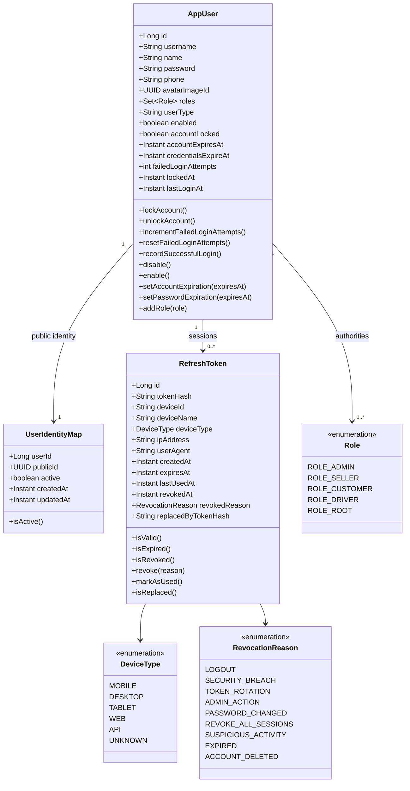
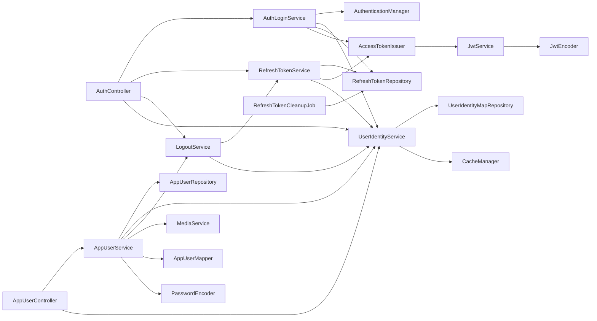
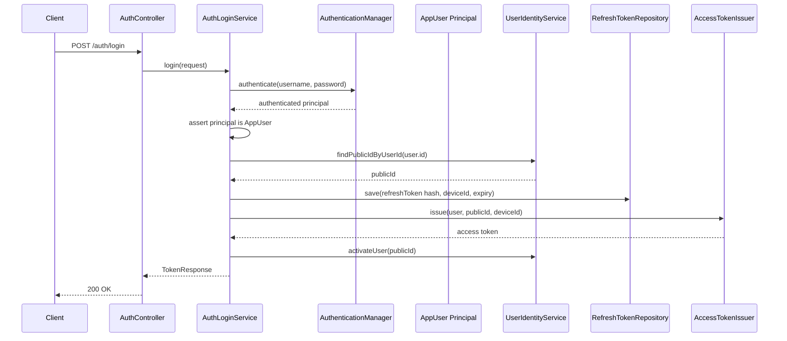
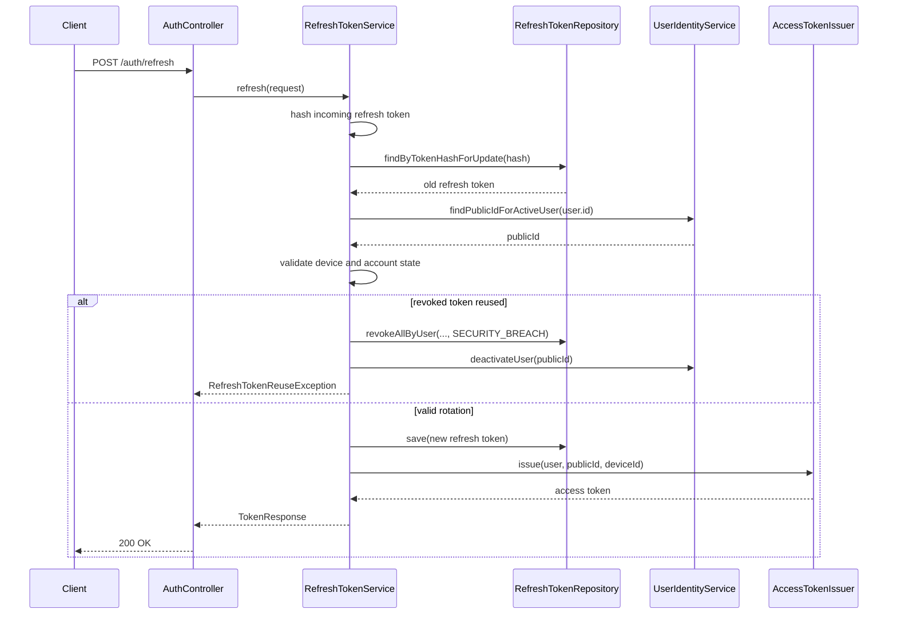
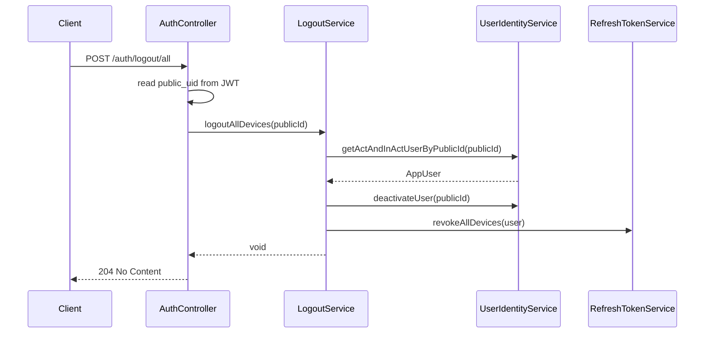
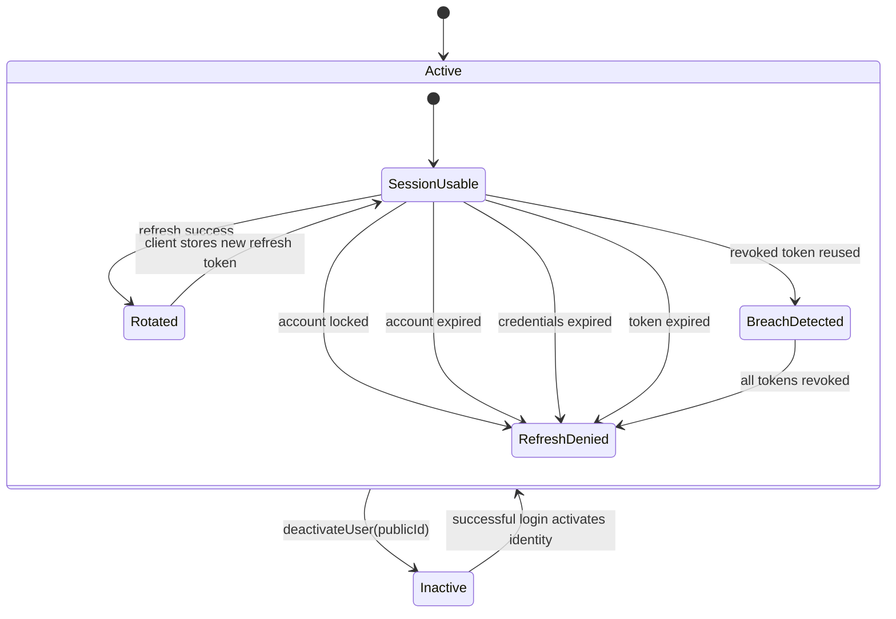
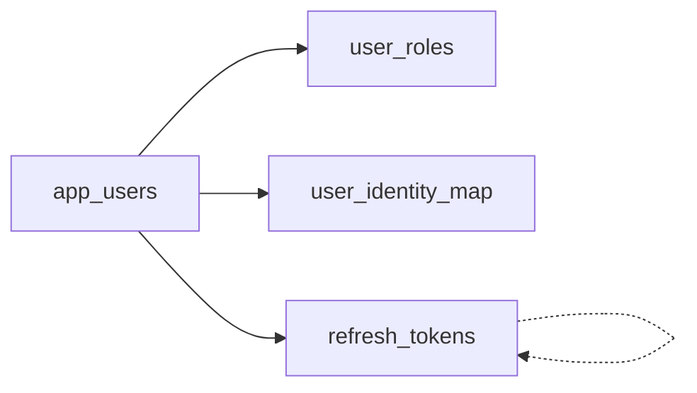

# Identity UML

## Class Diagram

```mermaid
classDiagram
    class AppUser {
        +Long id
        +String username
        +String name
        +String password
        +String phone
        +UUID avatarImageId
        +Set~Role~ roles
        +String userType
        +boolean enabled
        +boolean accountLocked
        +Instant accountExpiresAt
        +Instant credentialsExpireAt
        +int failedLoginAttempts
        +Instant lockedAt
        +Instant lastLoginAt
        +lockAccount()
        +unlockAccount()
        +incrementFailedLoginAttempts()
        +resetFailedLoginAttempts()
        +recordSuccessfulLogin()
        +disable()
        +enable()
        +setAccountExpiration(expiresAt)
        +setPasswordExpiration(expiresAt)
        +addRole(role)
    }

    class UserIdentityMap {
        +Long userId
        +UUID publicId
        +boolean active
        +Instant createdAt
        +Instant updatedAt
        +isActive()
    }

    class RefreshToken {
        +Long id
        +String tokenHash
        +String deviceId
        +String deviceName
        +DeviceType deviceType
        +String ipAddress
        +String userAgent
        +Instant createdAt
        +Instant expiresAt
        +Instant lastUsedAt
        +Instant revokedAt
        +RevocationReason revokedReason
        +String replacedByTokenHash
        +isValid()
        +isExpired()
        +isRevoked()
        +revoke(reason)
        +markAsUsed()
        +isReplaced()
    }

    class Role {
        <<enumeration>>
        ROLE_ADMIN
        ROLE_SELLER
        ROLE_CUSTOMER
        ROLE_DRIVER
        ROLE_ROOT
    }

    class DeviceType {
        <<enumeration>>
        MOBILE
        DESKTOP
        TABLET
        WEB
        API
        UNKNOWN
    }

    class RevocationReason {
        <<enumeration>>
        LOGOUT
        SECURITY_BREACH
        TOKEN_ROTATION
        ADMIN_ACTION
        PASSWORD_CHANGED
        REVOKE_ALL_SESSIONS
        SUSPICIOUS_ACTIVITY
        EXPIRED
        ACCOUNT_DELETED
    }

    AppUser "1" --> "1" UserIdentityMap : public identity
    AppUser "1" --> "0..*" RefreshToken : sessions
    AppUser "1" --> "1..*" Role : authorities
    RefreshToken --> DeviceType
    RefreshToken --> RevocationReason
```

## Service Dependency Diagram

```mermaid
flowchart LR
    AuthController["AuthController"] --> AuthLoginService["AuthLoginService"]
    AuthController --> RefreshTokenService["RefreshTokenService"]
    AuthController --> LogoutService["LogoutService"]
    AuthController --> UserIdentityService["UserIdentityService"]

    AppUserController["AppUserController"] --> AppUserService["AppUserService"]
    AppUserController --> UserIdentityService

    AppUserService --> AppUserRepository["AppUserRepository"]
    AppUserService --> UserIdentityService
    AppUserService --> LogoutService
    AppUserService --> MediaService["MediaService"]
    AppUserService --> AppUserMapper["AppUserMapper"]
    AppUserService --> PasswordEncoder["PasswordEncoder"]

    AuthLoginService --> AuthenticationManager["AuthenticationManager"]
    AuthLoginService --> UserIdentityService
    AuthLoginService --> RefreshTokenRepository["RefreshTokenRepository"]
    AuthLoginService --> AccessTokenIssuer["AccessTokenIssuer"]

    RefreshTokenService --> RefreshTokenRepository
    RefreshTokenService --> AccessTokenIssuer
    RefreshTokenService --> UserIdentityService

    LogoutService --> RefreshTokenService
    LogoutService --> UserIdentityService

    UserIdentityService --> UserIdentityMapRepository["UserIdentityMapRepository"]
    UserIdentityService --> CacheManager["CacheManager"]

    AccessTokenIssuer --> JwtService["JwtService"]
    JwtService --> JwtEncoder["JwtEncoder"]

    RefreshTokenCleanupJob["RefreshTokenCleanupJob"] --> RefreshTokenRepository
```

## Login Sequence

```mermaid
sequenceDiagram
    participant Client
    participant AuthController
    participant AuthLoginService
    participant AuthenticationManager
    participant AppUser as AppUser Principal
    participant UserIdentityService
    participant RefreshTokenRepository
    participant AccessTokenIssuer

    Client->>AuthController: POST /auth/login
    AuthController->>AuthLoginService: login(request)
    AuthLoginService->>AuthenticationManager: authenticate(username, password)
    AuthenticationManager-->>AuthLoginService: authenticated principal
    AuthLoginService->>AuthLoginService: assert principal is AppUser
    AuthLoginService->>UserIdentityService: findPublicIdByUserId(user.id)
    UserIdentityService-->>AuthLoginService: publicId
    AuthLoginService->>RefreshTokenRepository: save(refreshToken hash, deviceId, expiry)
    AuthLoginService->>AccessTokenIssuer: issue(user, publicId, deviceId)
    AccessTokenIssuer-->>AuthLoginService: access token
    AuthLoginService->>UserIdentityService: activateUser(publicId)
    AuthLoginService-->>AuthController: TokenResponse
    AuthController-->>Client: 200 OK
```

## Refresh Sequence

```mermaid
sequenceDiagram
    participant Client
    participant AuthController
    participant RefreshTokenService
    participant RefreshTokenRepository
    participant UserIdentityService
    participant AccessTokenIssuer

    Client->>AuthController: POST /auth/refresh
    AuthController->>RefreshTokenService: refresh(request)
    RefreshTokenService->>RefreshTokenService: hash incoming refresh token
    RefreshTokenService->>RefreshTokenRepository: findByTokenHashForUpdate(hash)
    RefreshTokenRepository-->>RefreshTokenService: old refresh token
    RefreshTokenService->>UserIdentityService: findPublicIdForActiveUser(user.id)
    UserIdentityService-->>RefreshTokenService: publicId
    RefreshTokenService->>RefreshTokenService: validate device and account state
    alt revoked token reused
        RefreshTokenService->>RefreshTokenRepository: revokeAllByUser(..., SECURITY_BREACH)
        RefreshTokenService->>UserIdentityService: deactivateUser(publicId)
        RefreshTokenService-->>AuthController: RefreshTokenReuseException
    else valid rotation
        RefreshTokenService->>RefreshTokenRepository: save(new refresh token)
        RefreshTokenService->>AccessTokenIssuer: issue(user, publicId, deviceId)
        AccessTokenIssuer-->>RefreshTokenService: access token
        RefreshTokenService-->>AuthController: TokenResponse
        AuthController-->>Client: 200 OK
    end
```

## Logout-All Sequence

```mermaid
sequenceDiagram
    participant Client
    participant AuthController
    participant LogoutService
    participant UserIdentityService
    participant RefreshTokenService

    Client->>AuthController: POST /auth/logout/all
    AuthController->>AuthController: read public_uid from JWT
    AuthController->>LogoutService: logoutAllDevices(publicId)
    LogoutService->>UserIdentityService: getActAndInActUserByPublicId(publicId)
    UserIdentityService-->>LogoutService: AppUser
    LogoutService->>UserIdentityService: deactivateUser(publicId)
    LogoutService->>RefreshTokenService: revokeAllDevices(user)
    LogoutService-->>AuthController: void
    AuthController-->>Client: 204 No Content
```

## State Diagram For Identity And Session Access

```mermaid
stateDiagram-v2
    [*] --> Active
    Active --> Inactive : deactivateUser(publicId)
    Inactive --> Active : successful login activates identity

    state Active {
        [*] --> SessionUsable
        SessionUsable --> RefreshDenied : account locked
        SessionUsable --> RefreshDenied : account expired
        SessionUsable --> RefreshDenied : credentials expired
        SessionUsable --> RefreshDenied : token expired
        SessionUsable --> Rotated : refresh success
        SessionUsable --> BreachDetected : revoked token reused
        Rotated --> SessionUsable : client stores new refresh token
        BreachDetected --> RefreshDenied : all tokens revoked
    }
```

## ER View

```mermaid
flowchart LR
    app_users["app_users"]
    user_roles["user_roles"]
    user_identity_map["user_identity_map"]
    refresh_tokens["refresh_tokens"]

    app_users --> user_roles
    app_users --> user_identity_map
    app_users --> refresh_tokens
    refresh_tokens -.-> refresh_tokens
```
