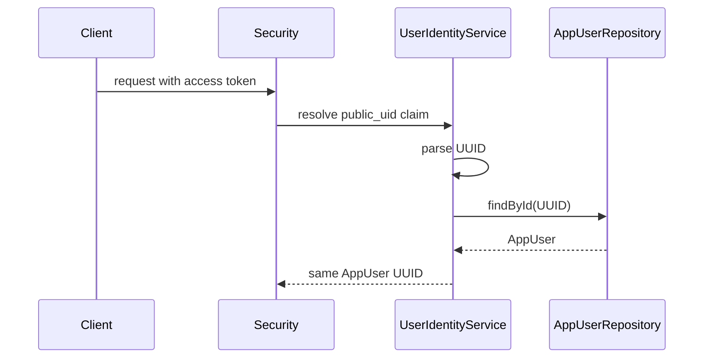
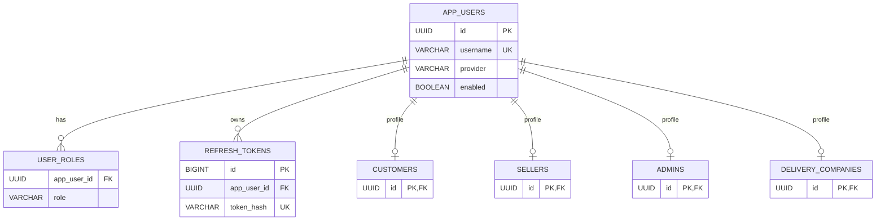
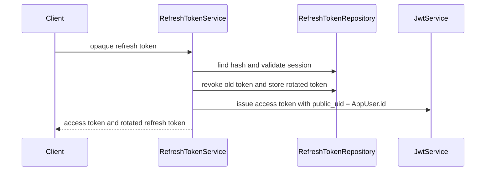

# Identity UML

## Token Resolution

```mermaid
sequenceDiagram
    participant Client
    participant Security
    participant UserIdentityService
    participant AppUserRepository

    Client->>Security: request with access token
    Security->>UserIdentityService: resolve public_uid claim
    UserIdentityService->>UserIdentityService: parse UUID
    UserIdentityService->>AppUserRepository: findById(UUID)
    AppUserRepository-->>UserIdentityService: AppUser
    UserIdentityService-->>Security: same AppUser UUID
```

## Persistence

```mermaid
erDiagram
    APP_USERS {
        UUID id PK
        VARCHAR username UK
        VARCHAR provider
        BOOLEAN enabled
    }
    USER_ROLES {
        UUID app_user_id FK
        VARCHAR role
    }
    REFRESH_TOKENS {
        BIGINT id PK
        UUID app_user_id FK
        VARCHAR token_hash UK
    }
    CUSTOMERS { UUID id PK,FK }
    SELLERS { UUID id PK,FK }
    ADMINS { UUID id PK,FK }
    DELIVERY_COMPANIES { UUID id PK,FK }

    APP_USERS ||--o{ USER_ROLES : has
    APP_USERS ||--o{ REFRESH_TOKENS : owns
    APP_USERS ||--o| CUSTOMERS : profile
    APP_USERS ||--o| SELLERS : profile
    APP_USERS ||--o| ADMINS : profile
    APP_USERS ||--o| DELIVERY_COMPANIES : profile
```

## Refresh Rotation

```mermaid
sequenceDiagram
    participant Client
    participant RefreshTokenService
    participant RefreshTokenRepository
    participant JwtService

    Client->>RefreshTokenService: opaque refresh token
    RefreshTokenService->>RefreshTokenRepository: find hash and validate session
    RefreshTokenService->>RefreshTokenRepository: revoke old token and store rotated token
    RefreshTokenService->>JwtService: issue access token with public_uid = AppUser.id
    RefreshTokenService-->>Client: access token and rotated refresh token
```
