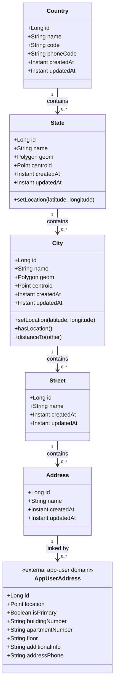
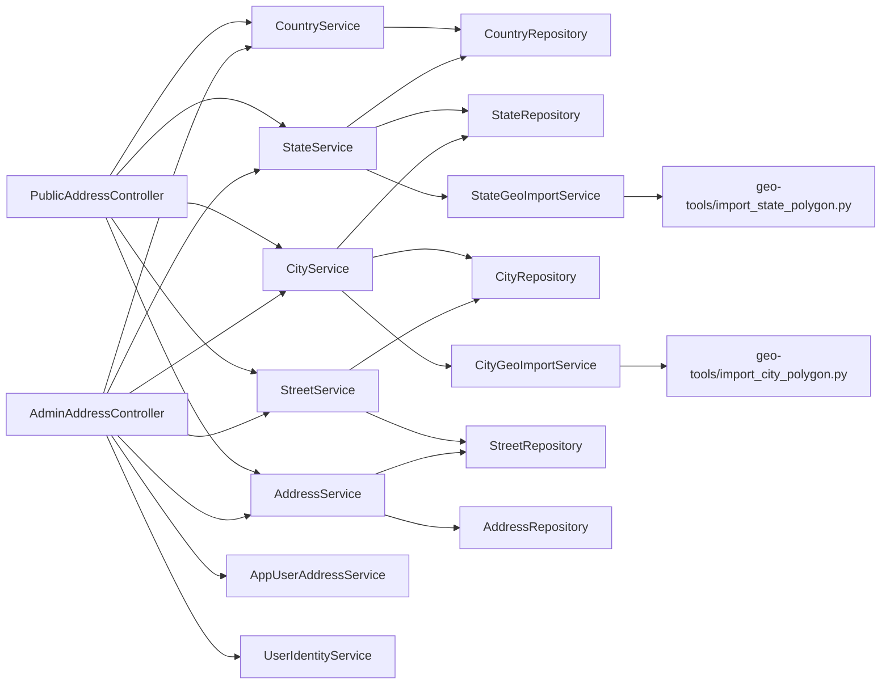
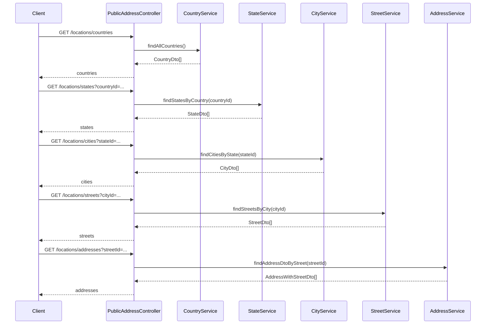
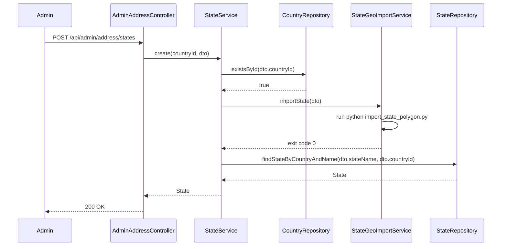
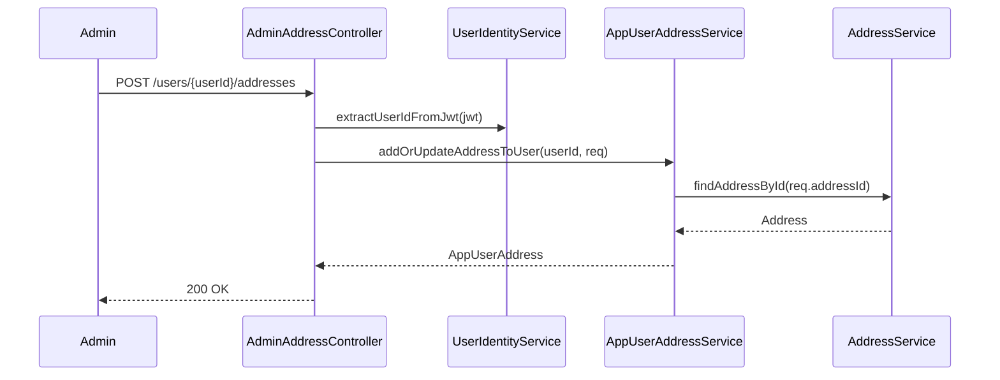
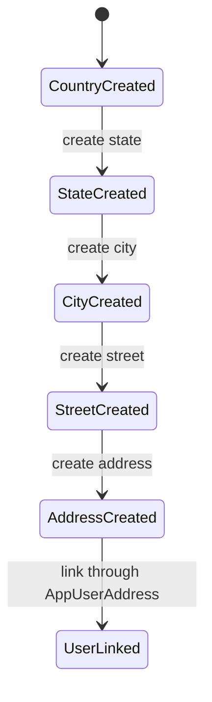
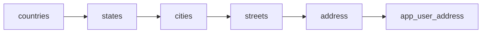

# Address UML

## Class Diagram

## Service Dependency Diagram

## Public Lookup Sequence

## State Geo-Import Sequence

## Admin User-Address Assignment Sequence

## State Diagram For Hierarchy Growth

## ER View

