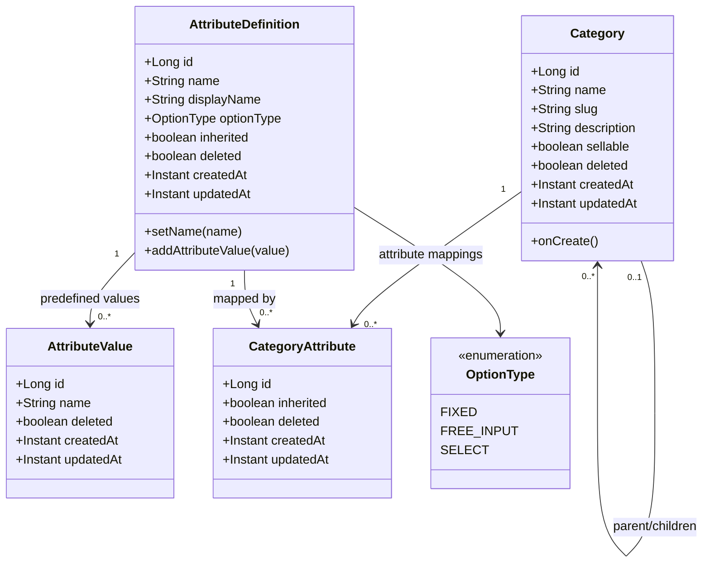
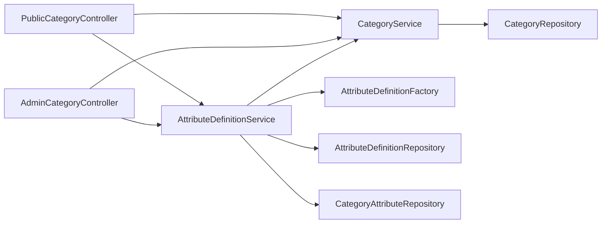
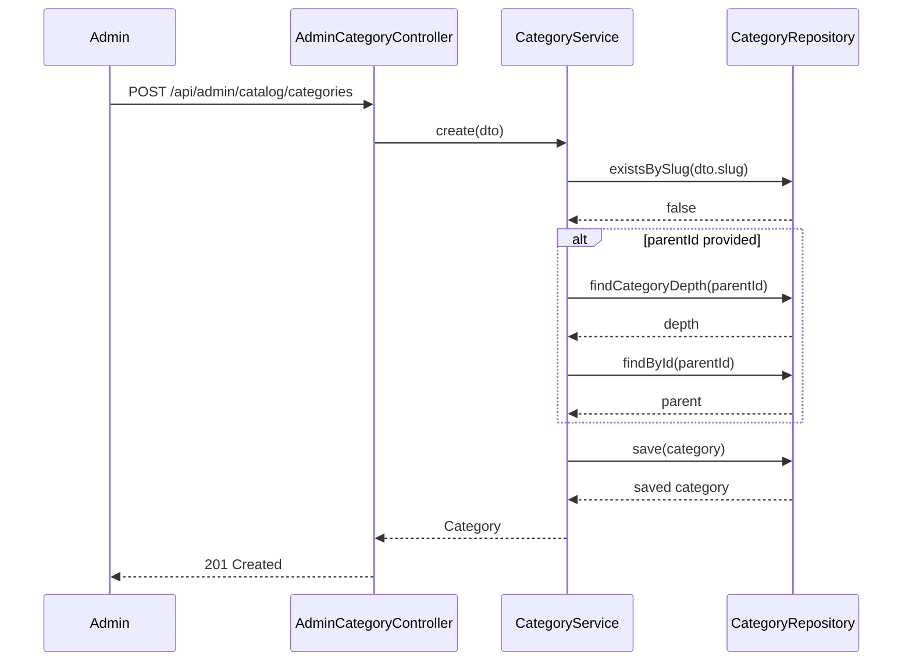
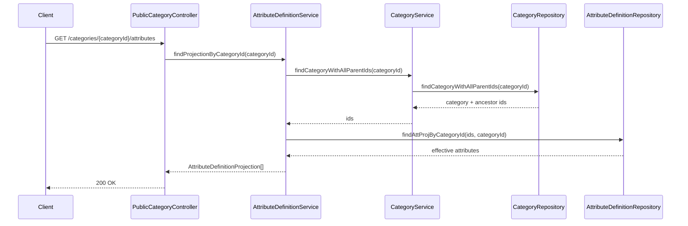
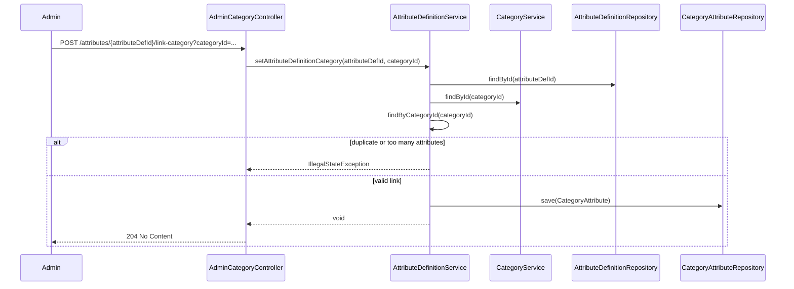
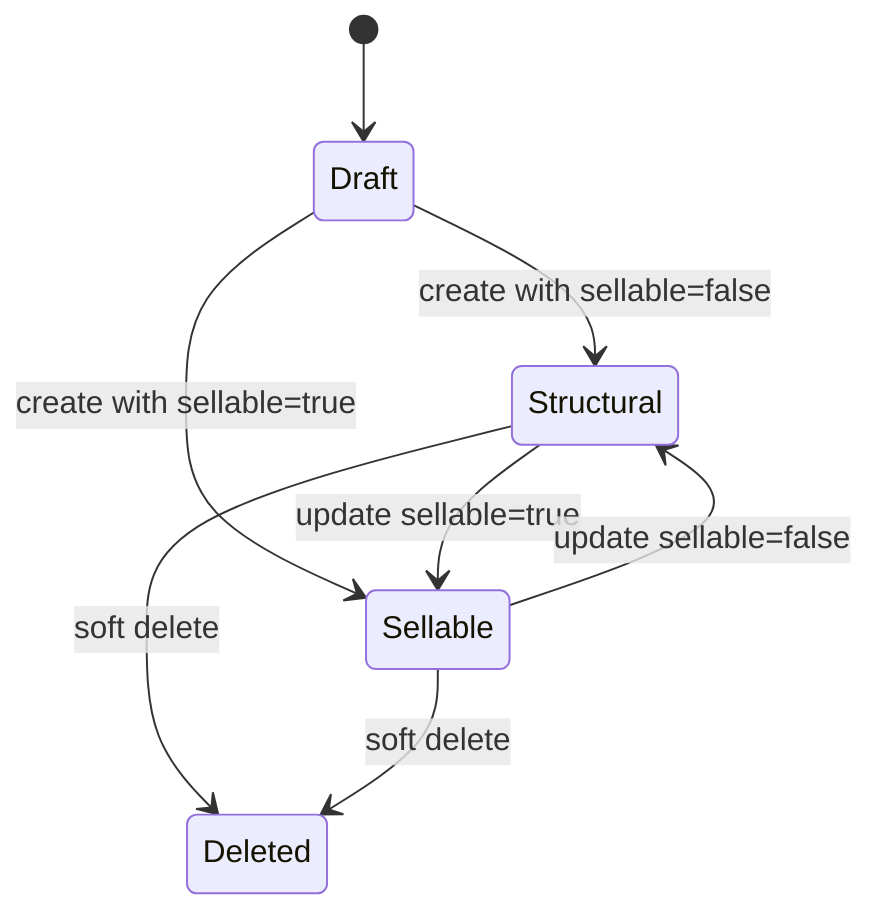
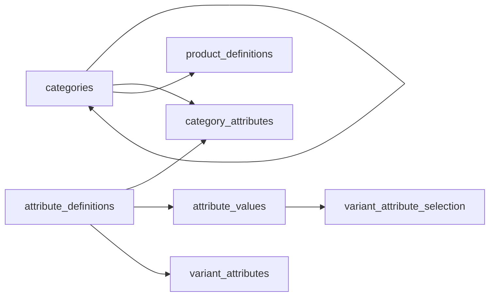

# Category UML

## Class Diagram

## Service Dependency Diagram

## Category Creation Sequence

## Effective Attribute Resolution Sequence

## Link Attribute To Category Sequence

## State Diagram For Category Node Lifecycle

## ER View

