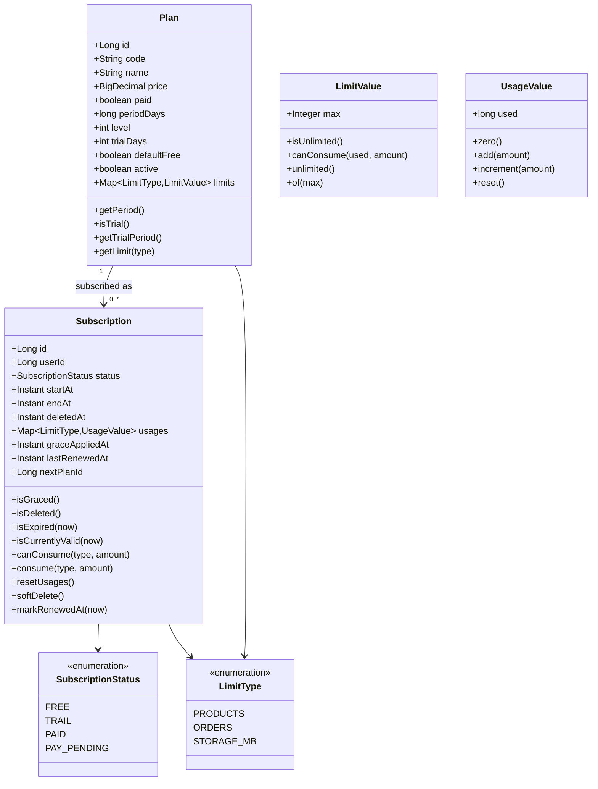
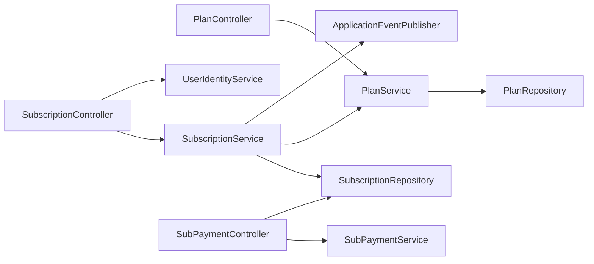
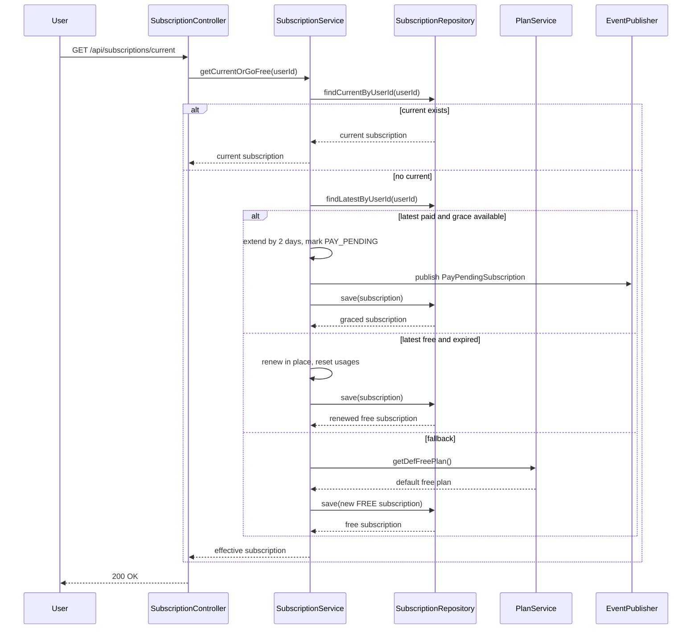
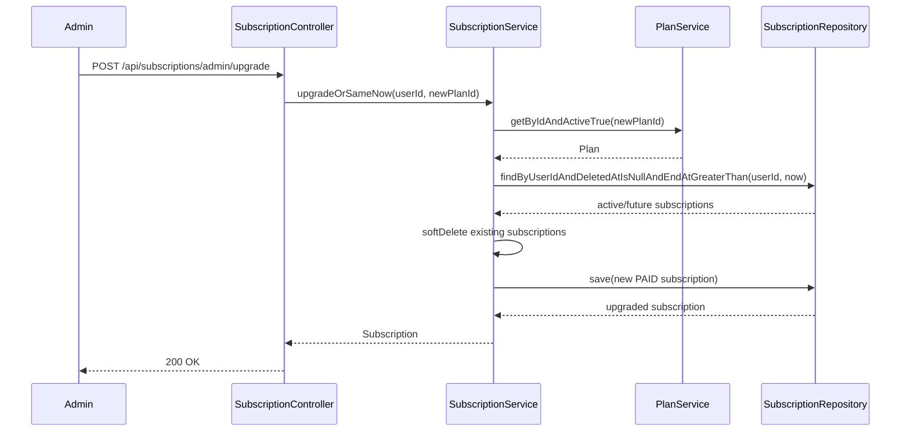
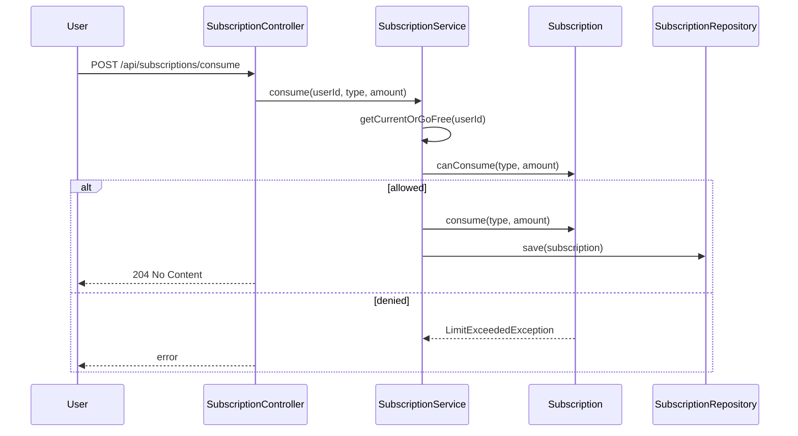
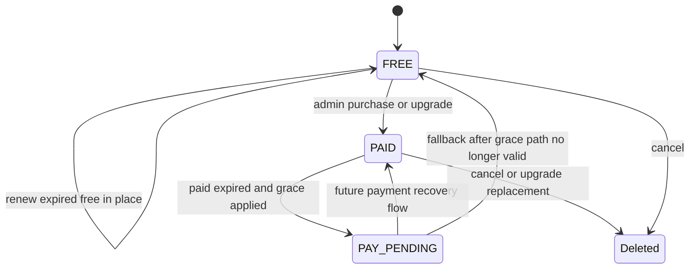
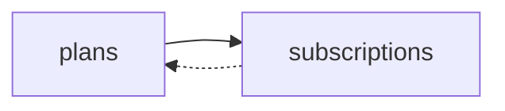

# Subscription UML

## Class Diagram

## Service Dependency Diagram

## Current Or Go Free Sequence

## Admin Upgrade Sequence

## Quota Consumption Sequence

## State Diagram For Subscription Lifecycle

## ER View

