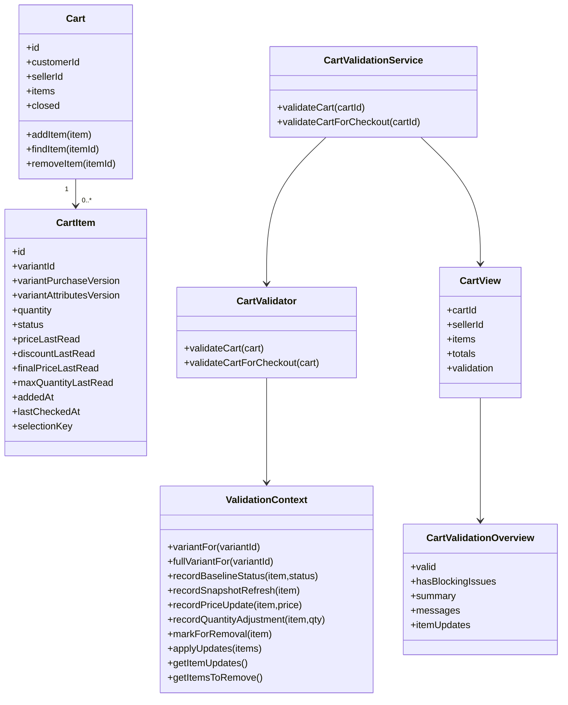
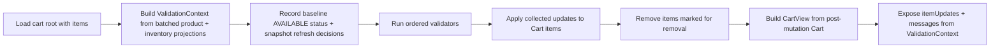
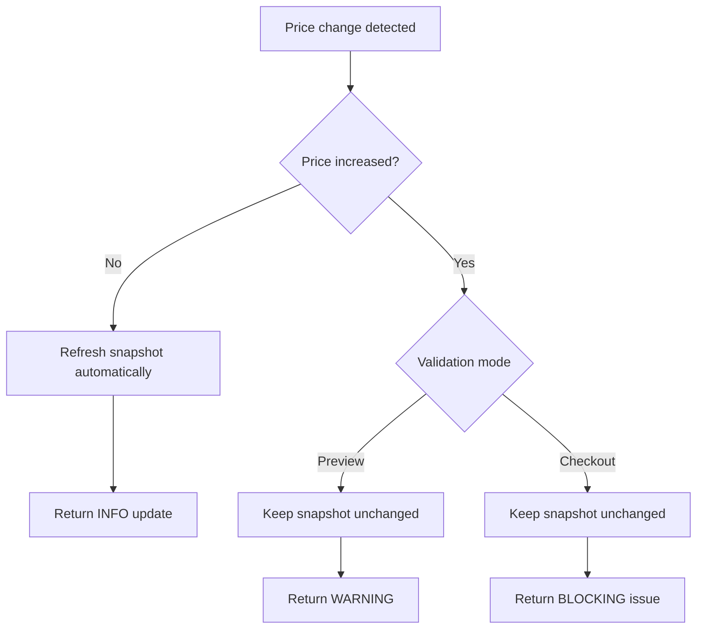
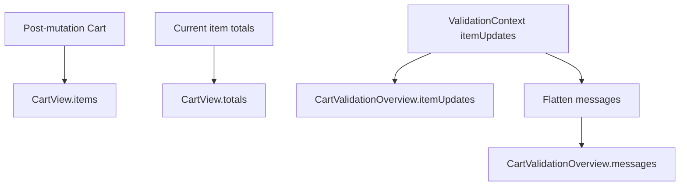

# Cart UML And Flow Diagrams

## Aggregate And Validation Components

```mermaid
classDiagram
    class Cart {
        +id
        +customerId
        +sellerId
        +items
        +closed
        +addItem(item)
        +findItem(itemId)
        +removeItem(itemId)
    }

    class CartItem {
        +id
        +variantId
        +variantPurchaseVersion
        +variantAttributesVersion
        +quantity
        +status
        +priceLastRead
        +discountLastRead
        +finalPriceLastRead
        +maxQuantityLastRead
        +addedAt
        +lastCheckedAt
        +selectionKey
    }

    class ValidationContext {
        +variantFor(variantId)
        +fullVariantFor(variantId)
        +recordBaselineStatus(item,status)
        +recordSnapshotRefresh(item)
        +recordPriceUpdate(item,price)
        +recordQuantityAdjustment(item,qty)
        +markForRemoval(item)
        +applyUpdates(items)
        +getItemUpdates()
        +getItemsToRemove()
    }

    class CartValidator {
        +validateCart(cart)
        +validateCartForCheckout(cart)
    }

    class CartValidationService {
        +validateCart(cartId)
        +validateCartForCheckout(cartId)
    }

    class CartView {
        +cartId
        +sellerId
        +items
        +totals
        +validation
    }

    class CartValidationOverview {
        +valid
        +hasBlockingIssues
        +summary
        +messages
        +itemUpdates
    }

    Cart "1" --> "0..*" CartItem
    CartValidationService --> CartValidator
    CartValidator --> ValidationContext
    CartValidationService --> CartView
    CartView --> CartValidationOverview
```

## Validation Pipeline

```mermaid
flowchart LR
    A["Load cart root with items"] --> B["Build ValidationContext from batched product + inventory projections"]
    B --> C["Record baseline AVAILABLE status + snapshot refresh decisions"]
    C --> D["Run ordered validators"]
    D --> E["Apply collected updates to Cart items"]
    E --> F["Remove items marked for removal"]
    F --> G["Build CartView from post-mutation Cart"]
    G --> H["Expose itemUpdates + messages from ValidationContext"]
```

## Preview vs Checkout

```mermaid
flowchart TD
    A["Price change detected"] --> B{"Price increased?"}
    B -- "No" --> C["Refresh snapshot automatically"]
    C --> D["Return INFO update"]
    B -- "Yes" --> E{"Validation mode"}
    E -- "Preview" --> F["Keep snapshot unchanged"]
    F --> G["Return WARNING"]
    E -- "Checkout" --> H["Keep snapshot unchanged"]
    H --> I["Return BLOCKING issue"]
```

## Response Composition

```mermaid
flowchart TD
    A["Post-mutation Cart"] --> B["CartView.items"]
    C["Current item totals"] --> D["CartView.totals"]
    E["ValidationContext itemUpdates"] --> F["CartValidationOverview.itemUpdates"]
    E --> G["Flatten messages"]
    G --> H["CartValidationOverview.messages"]
```
