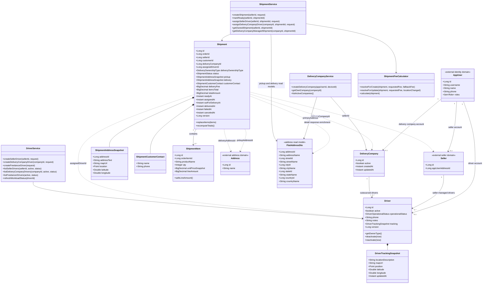
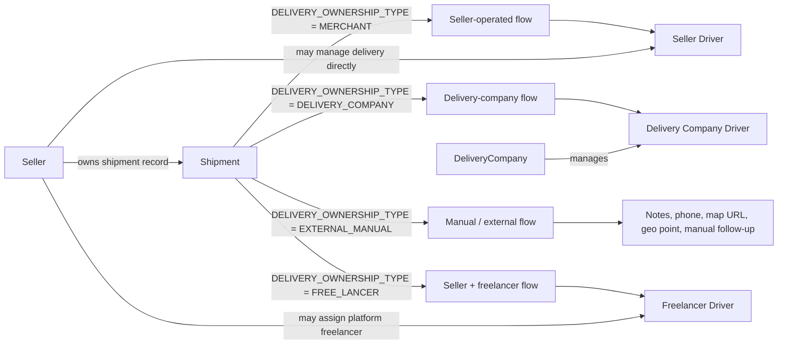
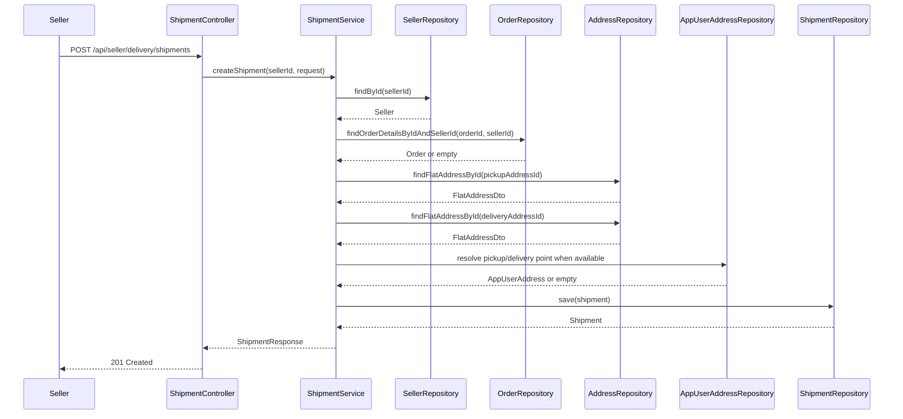
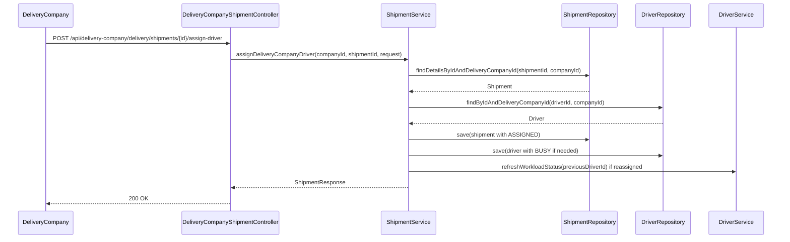
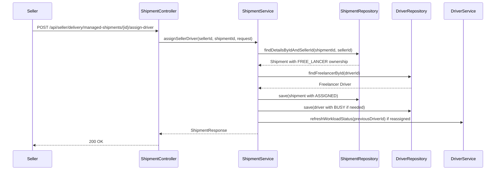
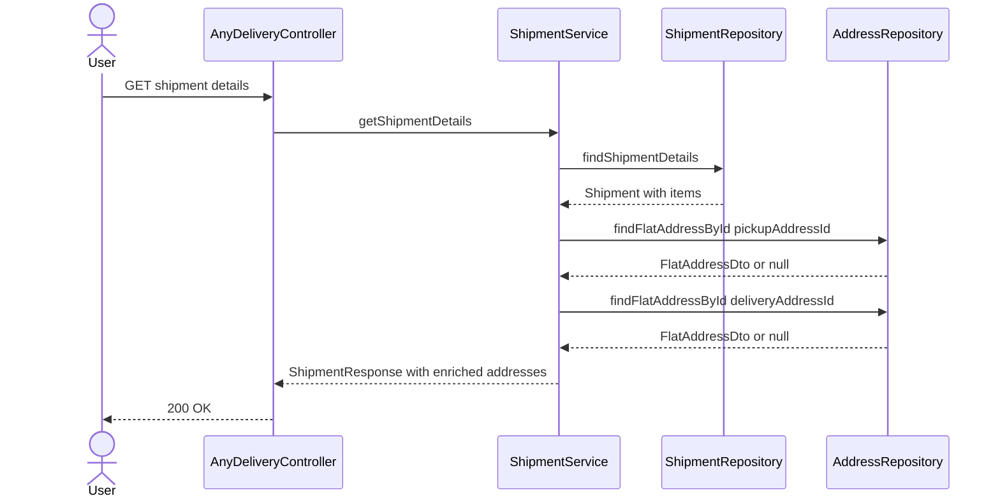
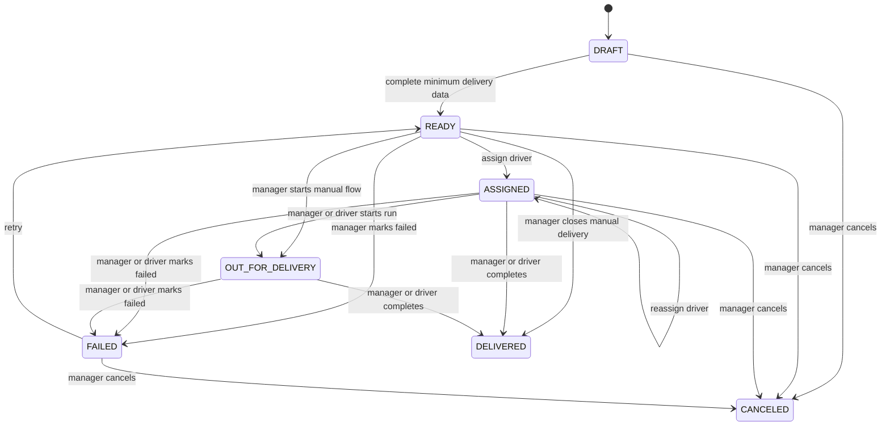
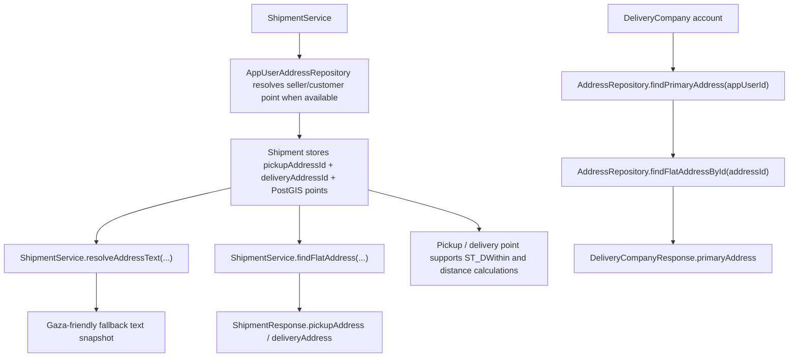

# Delivery UML

## Class Diagram

## Ownership View

## Seller Shipment Creation Sequence

## Delivery Company Assignment Sequence

## Seller Freelancer Assignment Sequence

## Shipment Detail Read With Address Enrichment

## Shipment Lifecycle

## Address-Domain Integration View

