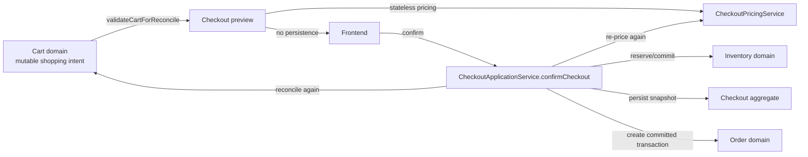
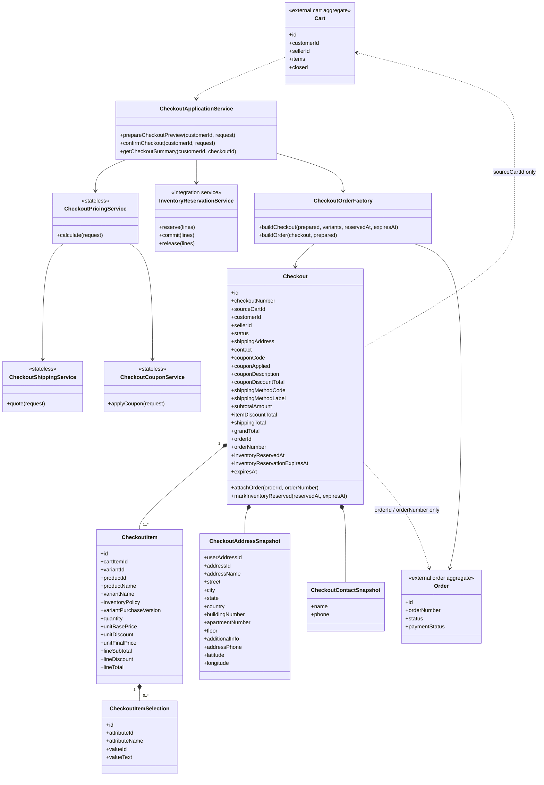
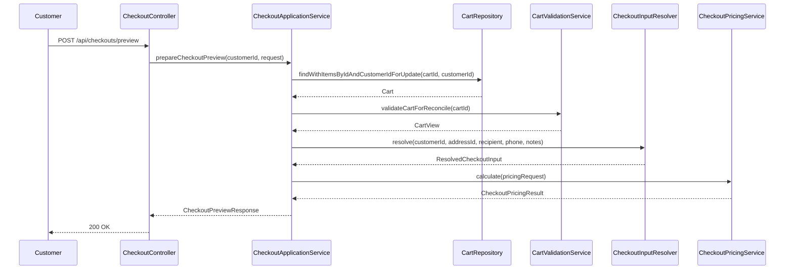
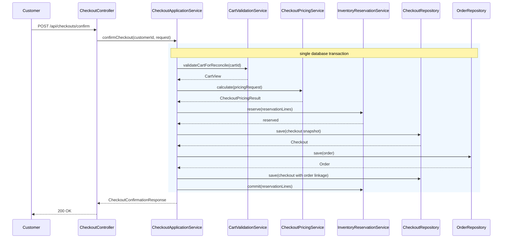
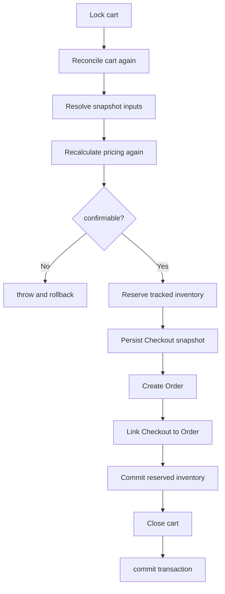
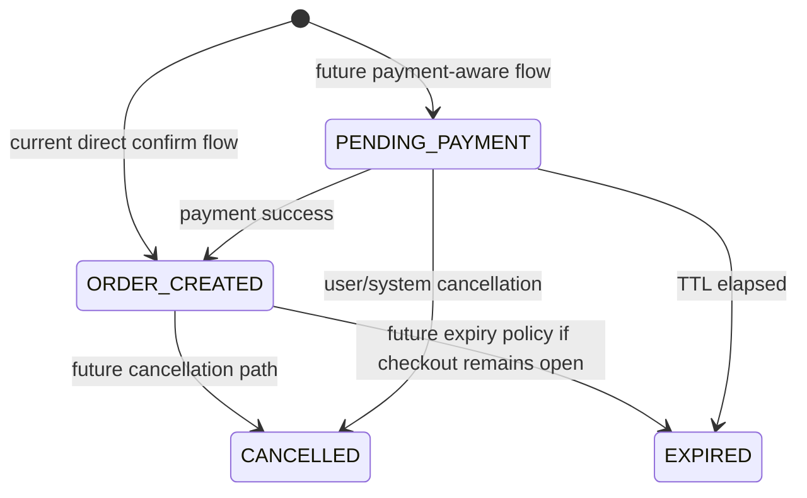
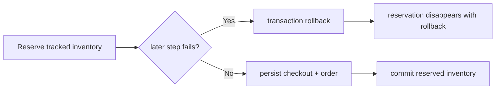
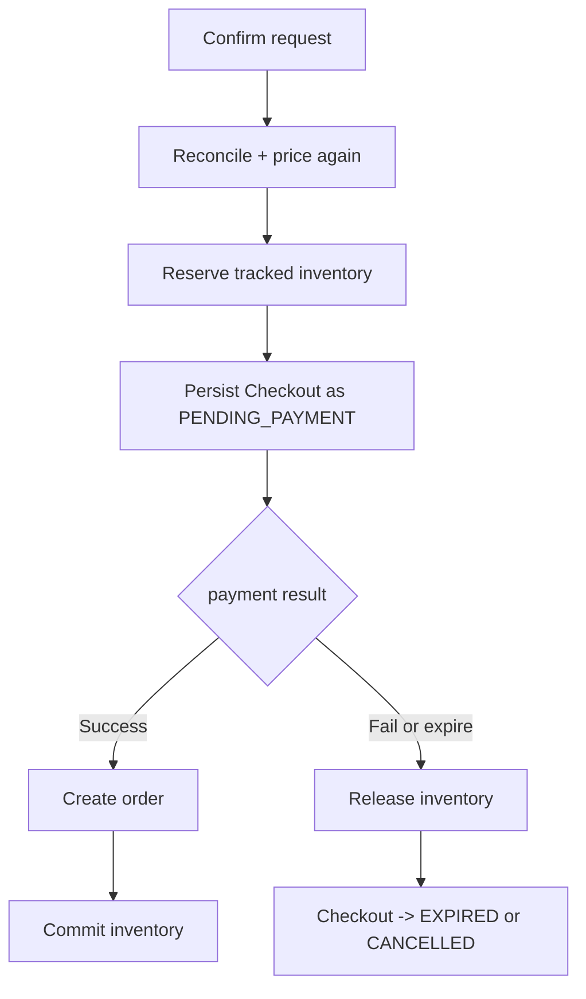
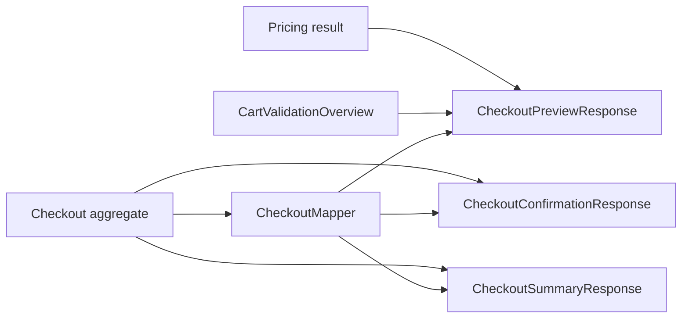

# Checkout UML And Flow Diagrams

## Context And Boundaries

## Class Diagram

## Preview Sequence

## Confirm Sequence

## Transaction Boundary View

## Lifecycle State Diagram

## Reservation And Failure Model

## Future Payment Evolution

## Read Model / API View

