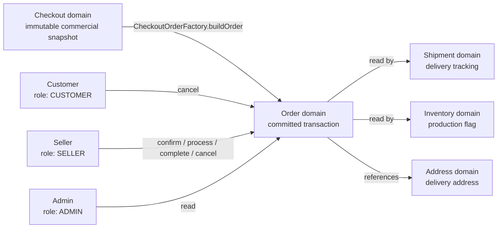
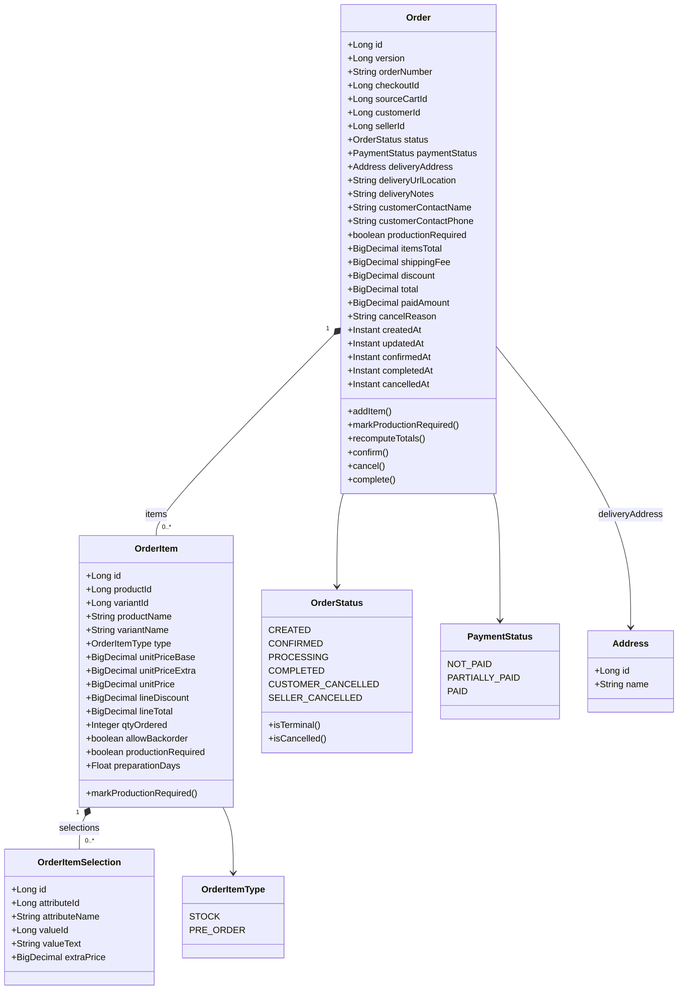
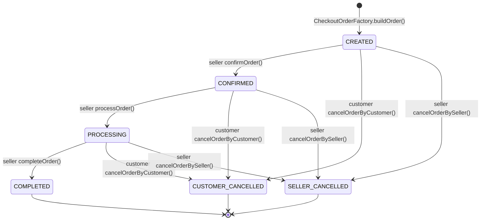
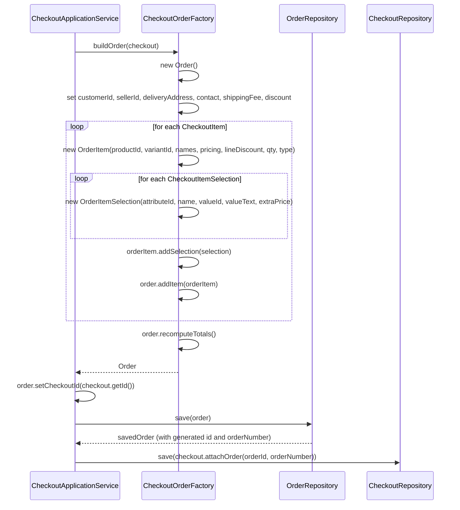
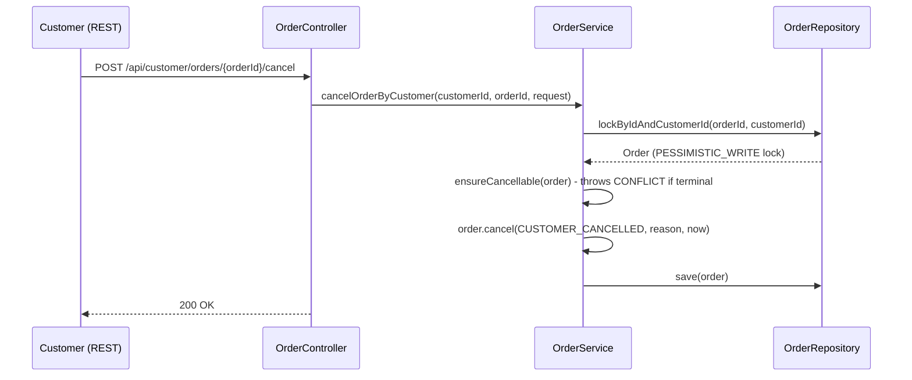
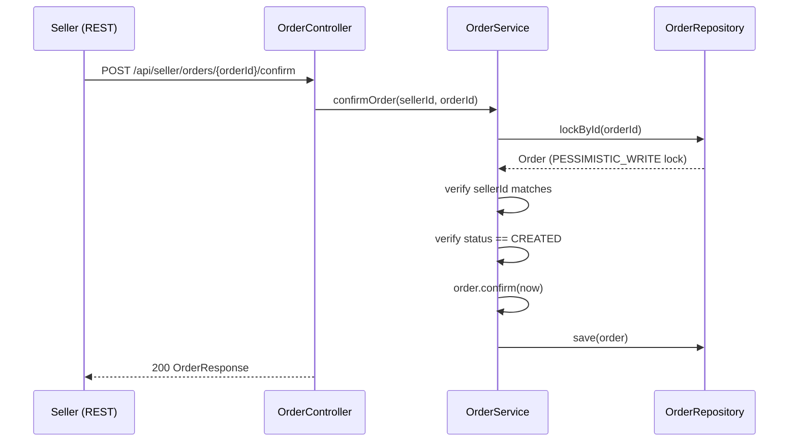

# Order UML And Flow Diagrams

## Context And Boundaries

---

## Class Diagram

---

## Lifecycle State Machine

---

## Order Creation Flow

---

## Customer Cancel Flow

---

## Seller Lifecycle Flow

---

## Repository Query Map

```mermaid
flowchart TD
    subgraph OrderRepository
        LBI["lockById(id)\nPESSIMISTIC_WRITE"]
        LBIAC["lockByIdAndCustomerId(id, customerId)\nPESSIMISTIC_WRITE"]
        FBN["findByOrderNumber(number)"]
        FBIAC["findByIdAndCustomerId(id, customerId)"]
        FBIAS["findByIdAndSellerId(id, sellerId)"]
        FBCID["findByCustomerIdOrderByCreatedAtDesc(customerId)"]
        FBCIDS["findByCustomerIdAndStatusOrderByCreatedAtDesc(customerId, status)"]
        FBSID["findBySellerIdOrderByCreatedAtDesc(sellerId)"]
        FBSIDS["findBySellerIdAndStatusOrderByCreatedAtDesc(sellerId, status)"]
        SFA["searchForAdmin(filters)\nJPQL with nullable params"]
        FDDIAS["findOrderDetailsByIdAndSellerId(orderId, sellerId)\nJOIN FETCH items"]
    end

    OS_cancel["cancelOrderByCustomer"] --> LBIAC
    OS_seller["seller mutations"] --> LBI
    OS_getCust["getCustomerOrder"] --> FBIAC
    OS_getSeller["getSellerOrder"] --> FBIAS
    OS_listCust["listCustomerOrders"] --> FBCID
    OS_listCustF["listCustomerOrders + status"] --> FBCIDS
    OS_listSell["listSellerOrders"] --> FBSID
    OS_listSellF["listSellerOrders + status"] --> FBSIDS
    OS_admin["listAdminOrders"] --> SFA
    ShipmentService["ShipmentService.getSourceOrder"] --> FDDIAS
```

