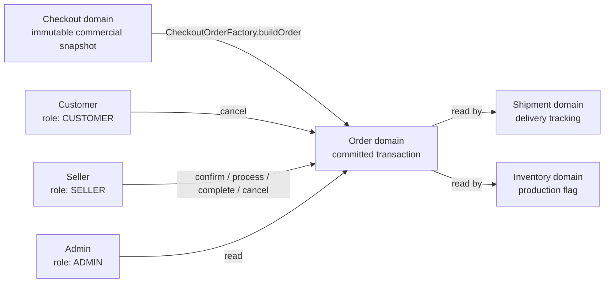
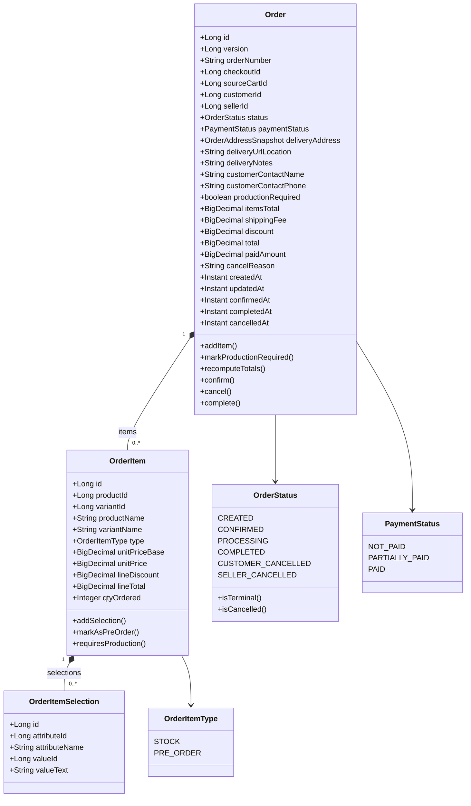
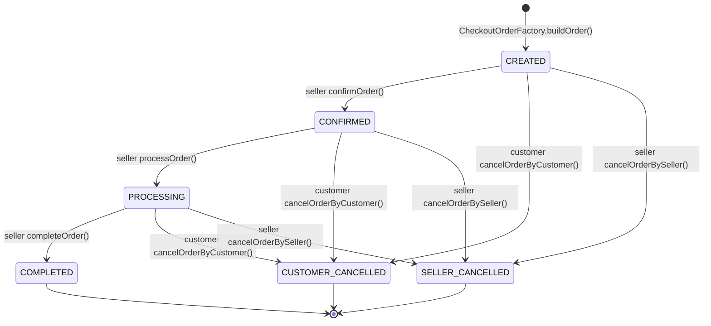
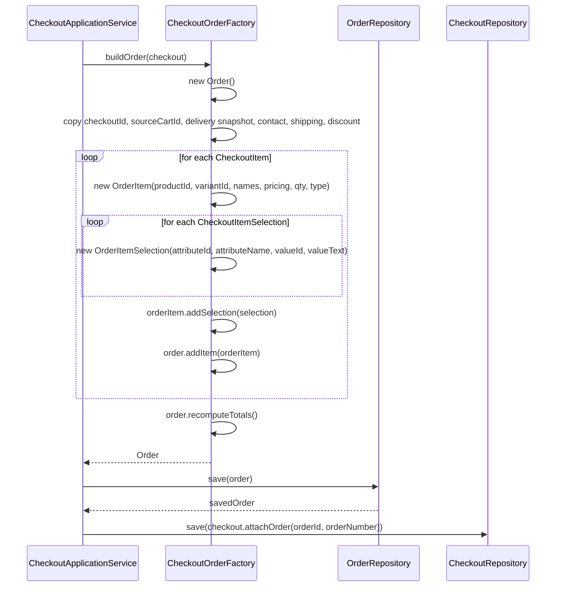

# Order UML And Flow Diagrams

## Context And Boundaries

```mermaid
flowchart LR
    Checkout["Checkout domain\nimmutable commercial snapshot"] -->|CheckoutOrderFactory.buildOrder| Order["Order domain\ncommitted transaction"]
    Order -->|read by| Shipment["Shipment domain\ndelivery tracking"]
    Order -->|read by| Inventory["Inventory domain\nproduction flag"]

    Customer["Customer\nrole: CUSTOMER"] -->|cancel| Order
    Seller["Seller\nrole: SELLER"] -->|confirm / process / complete / cancel| Order
    Admin["Admin\nrole: ADMIN"] -->|read| Order
```

---

## Class Diagram

```mermaid
classDiagram
    class Order {
        +Long id
        +Long version
        +String orderNumber
        +Long checkoutId
        +Long sourceCartId
        +Long customerId
        +Long sellerId
        +OrderStatus status
        +PaymentStatus paymentStatus
        +OrderAddressSnapshot deliveryAddress
        +String deliveryUrlLocation
        +String deliveryNotes
        +String customerContactName
        +String customerContactPhone
        +boolean productionRequired
        +BigDecimal itemsTotal
        +BigDecimal shippingFee
        +BigDecimal discount
        +BigDecimal total
        +BigDecimal paidAmount
        +String cancelReason
        +Instant createdAt
        +Instant updatedAt
        +Instant confirmedAt
        +Instant completedAt
        +Instant cancelledAt
        +addItem()
        +markProductionRequired()
        +recomputeTotals()
        +confirm()
        +cancel()
        +complete()
    }

    class OrderItem {
        +Long id
        +Long productId
        +Long variantId
        +String productName
        +String variantName
        +OrderItemType type
        +BigDecimal unitPriceBase
        +BigDecimal unitPrice
        +BigDecimal lineDiscount
        +BigDecimal lineTotal
        +Integer qtyOrdered
        +addSelection()
        +markAsPreOrder()
        +requiresProduction()
    }

    class OrderItemSelection {
        +Long id
        +Long attributeId
        +String attributeName
        +Long valueId
        +String valueText
    }

    class OrderStatus {
        CREATED
        CONFIRMED
        PROCESSING
        COMPLETED
        CUSTOMER_CANCELLED
        SELLER_CANCELLED
        +isTerminal()
        +isCancelled()
    }

    class PaymentStatus {
        NOT_PAID
        PARTIALLY_PAID
        PAID
    }

    class OrderItemType {
        STOCK
        PRE_ORDER
    }

    Order "1" *-- "0..*" OrderItem : items
    OrderItem "1" *-- "0..*" OrderItemSelection : selections
    Order --> OrderStatus
    Order --> PaymentStatus
    OrderItem --> OrderItemType
```

---

## Lifecycle State Machine

```mermaid
stateDiagram-v2
    [*] --> CREATED : CheckoutOrderFactory.buildOrder()

    CREATED --> CONFIRMED : seller confirmOrder()
    CONFIRMED --> PROCESSING : seller processOrder()
    PROCESSING --> COMPLETED : seller completeOrder()

    CREATED --> CUSTOMER_CANCELLED : customer cancelOrderByCustomer()
    CONFIRMED --> CUSTOMER_CANCELLED : customer cancelOrderByCustomer()
    PROCESSING --> CUSTOMER_CANCELLED : customer cancelOrderByCustomer()

    CREATED --> SELLER_CANCELLED : seller cancelOrderBySeller()
    CONFIRMED --> SELLER_CANCELLED : seller cancelOrderBySeller()
    PROCESSING --> SELLER_CANCELLED : seller cancelOrderBySeller()

    COMPLETED --> [*]
    CUSTOMER_CANCELLED --> [*]
    SELLER_CANCELLED --> [*]
```

---

## Order Creation Flow

```mermaid
sequenceDiagram
    participant CAS as CheckoutApplicationService
    participant COF as CheckoutOrderFactory
    participant OR as OrderRepository
    participant CR as CheckoutRepository

    CAS->>COF: buildOrder(checkout)
    COF->>COF: new Order()
    COF->>COF: copy checkoutId, sourceCartId, delivery snapshot, contact, shipping, discount
    loop for each CheckoutItem
        COF->>COF: new OrderItem(productId, variantId, names, pricing, qty, type)
        loop for each CheckoutItemSelection
            COF->>COF: new OrderItemSelection(attributeId, attributeName, valueId, valueText)
        end
        COF->>COF: orderItem.addSelection(selection)
        COF->>COF: order.addItem(orderItem)
    end
    COF->>COF: order.recomputeTotals()
    COF-->>CAS: Order

    CAS->>OR: save(order)
    OR-->>CAS: savedOrder
    CAS->>CR: save(checkout.attachOrder(orderId, orderNumber))
```

---

## Repository Query Map

```mermaid
flowchart TD
    subgraph OrderRepository
        LBI["lockById(id)\nPESSIMISTIC_WRITE"]
        LBIAC["lockByIdAndCustomerId(id, customerId)\nPESSIMISTIC_WRITE"]
        FBN["findByOrderNumber(number)"]
        FBIAC["findByIdAndCustomerId(id, customerId)"]
        FBIAS["findByIdAndSellerId(id, sellerId)"]
        FBCID["findByCustomerIdOrderByCreatedAtDesc(customerId)"]
        FBCIDS["findByCustomerIdAndStatusOrderByCreatedAtDesc(customerId, status)"]
        FBSID["findBySellerIdOrderByCreatedAtDesc(sellerId)"]
        FBSIDS["findBySellerIdAndStatusOrderByCreatedAtDesc(sellerId, status)"]
        SFA["searchForAdmin(filters)\nJPQL with nullable params"]
        FDDIAS["findOrderDetailsByIdAndSellerId(orderId, sellerId)\nJOIN FETCH items"]
    end

    OS_cancel["cancelOrderByCustomer"] --> LBIAC
    OS_seller["seller mutations"] --> LBI
    OS_getCust["getCustomerOrder"] --> FBIAC
    OS_getSeller["getSellerOrder"] --> FBIAS
    OS_listCust["listCustomerOrders"] --> FBCID
    OS_listCustF["listCustomerOrders + status"] --> FBCIDS
    OS_listSell["listSellerOrders"] --> FBSID
    OS_listSellF["listSellerOrders + status"] --> FBSIDS
    OS_admin["listAdminOrders"] --> SFA
    ShipmentService["ShipmentService.getSourceOrder"] --> FDDIAS
```
