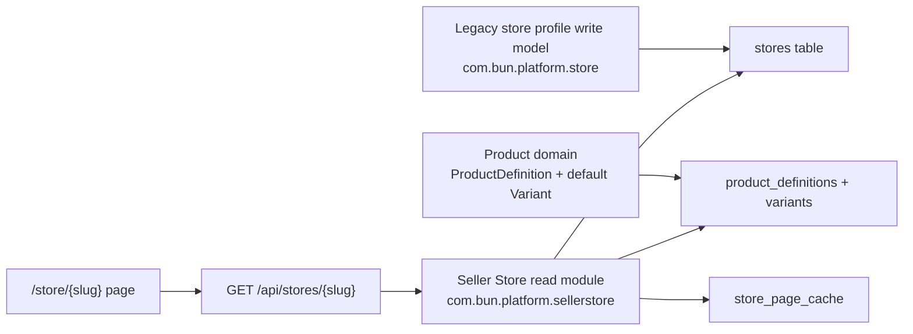
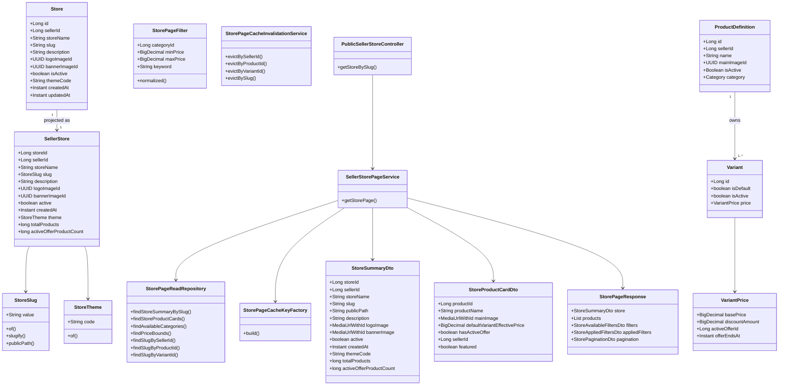
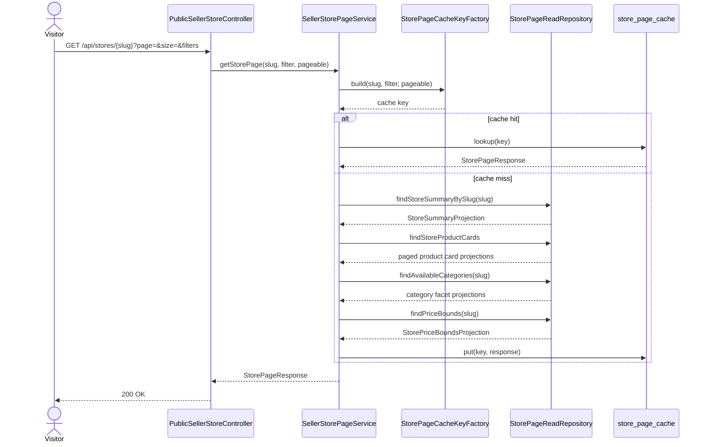
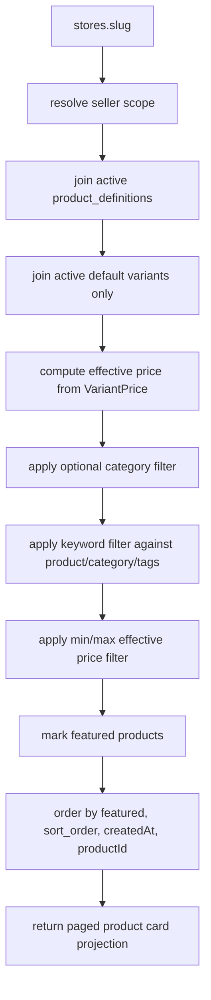
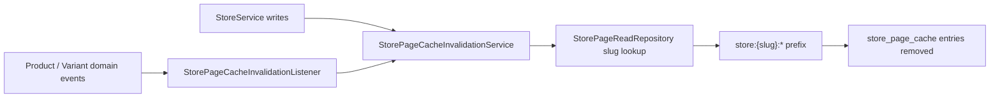
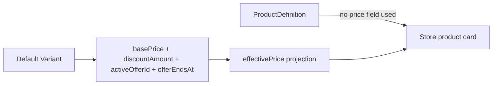
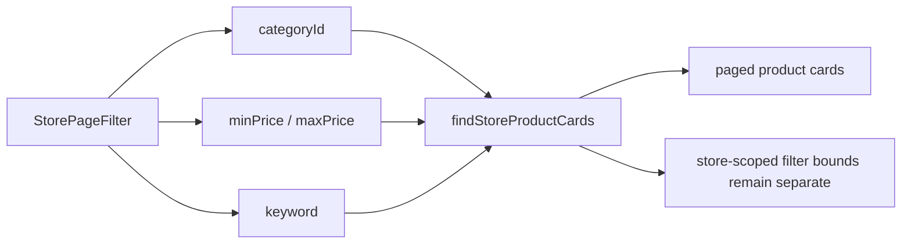
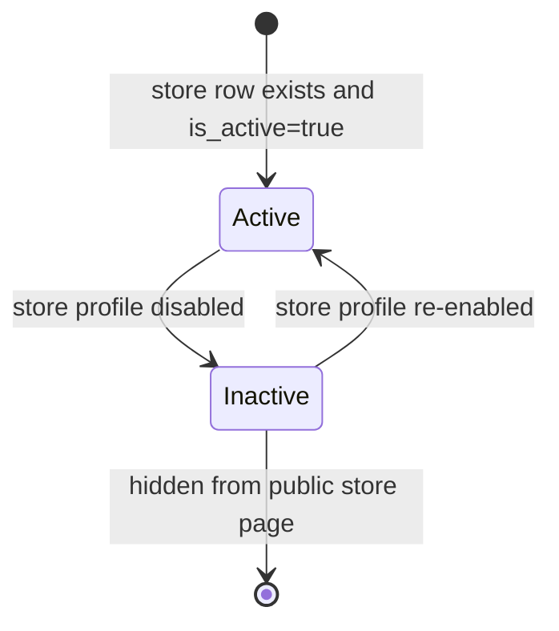
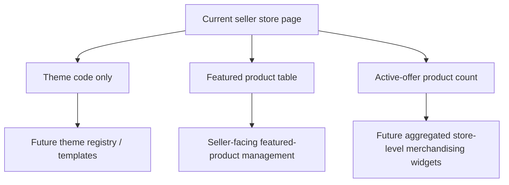

# Seller Store UML

## Context And Boundaries

## Class Diagram

## Store Page Read Sequence

## Product Card Query Pipeline

## Cache Invalidation Flow

## Price SSOT Diagram

## Filtering Model

## Store Profile State

## Future Extension View

