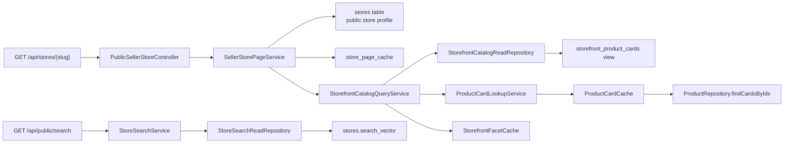
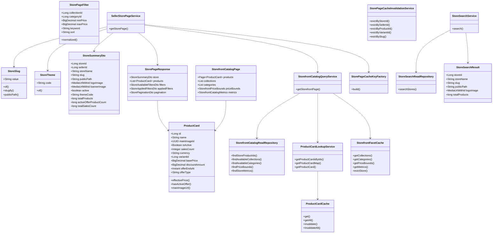
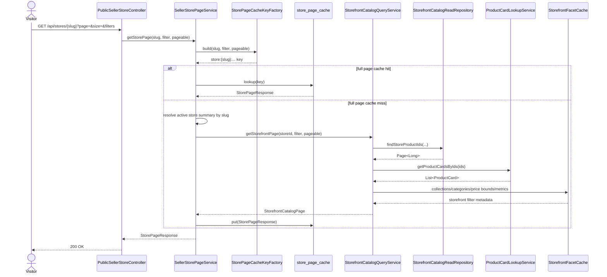
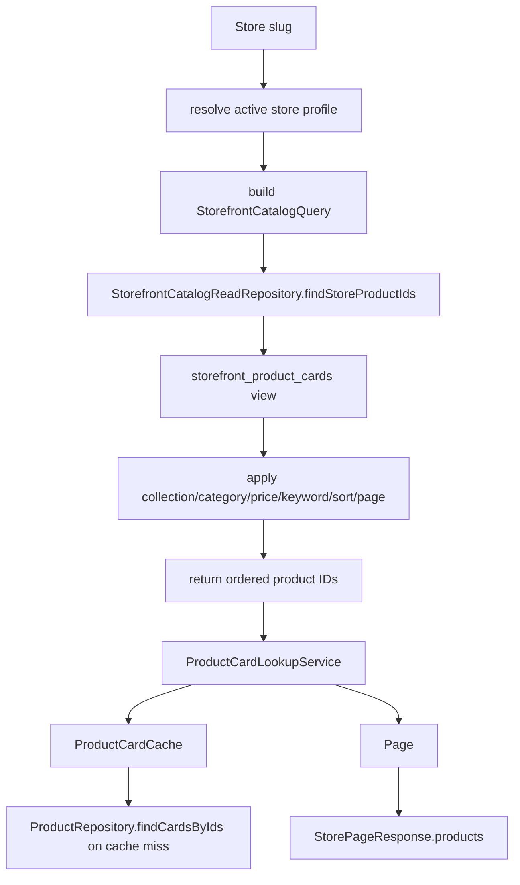
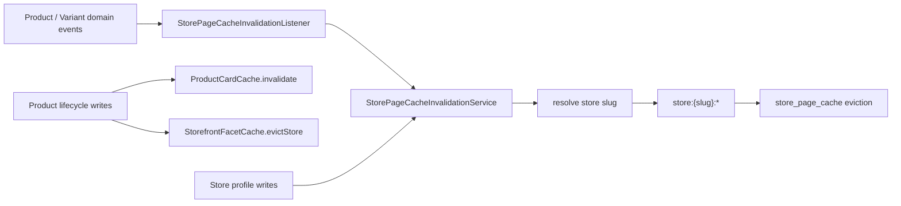
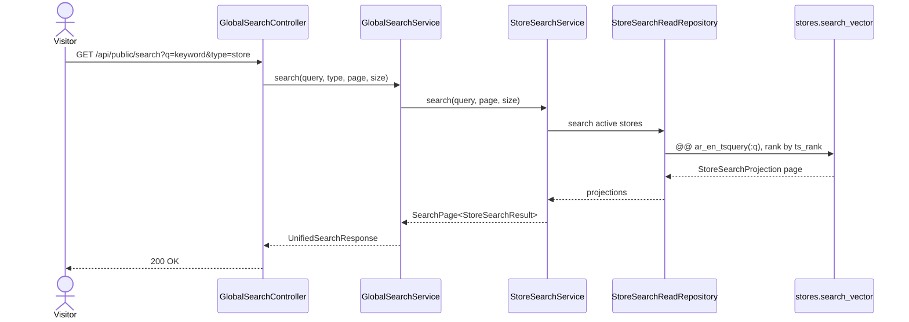
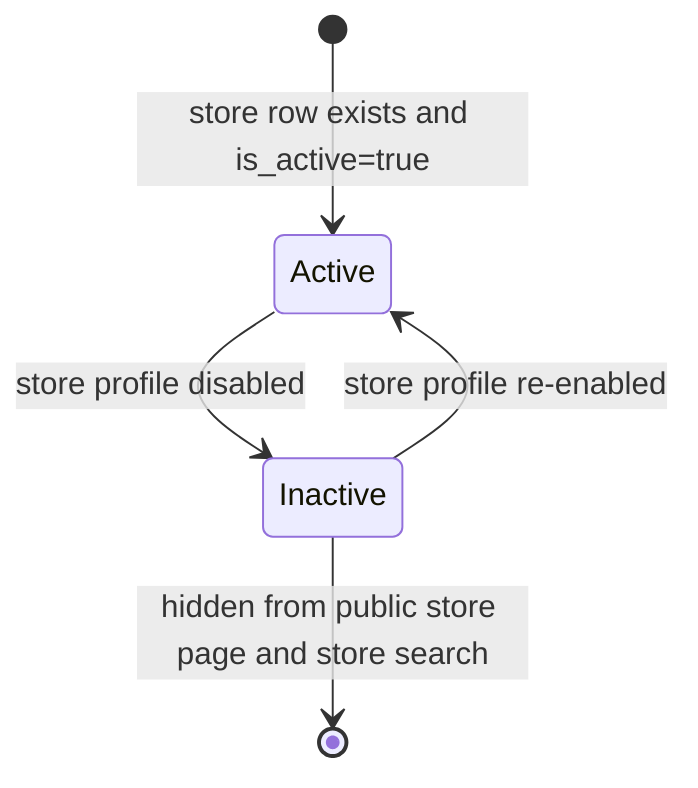
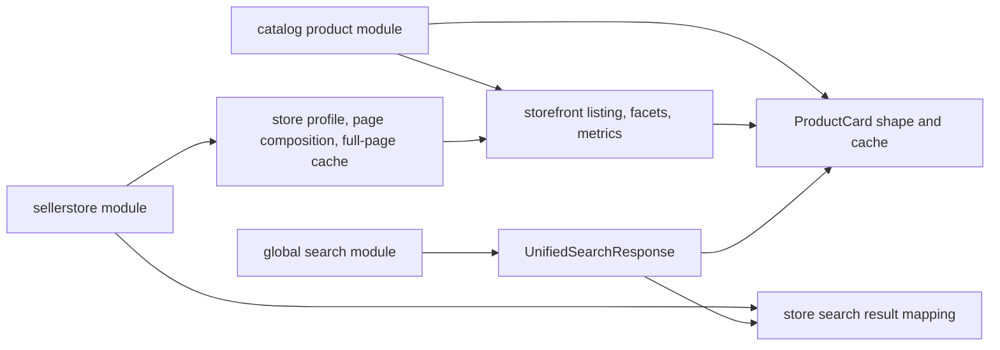

# Seller Store UML

## Context And Boundaries

```mermaid
flowchart LR
    PublicApi["GET /api/stores/{slug}"] --> Controller["PublicSellerStoreController"]
    Controller --> StorePage["SellerStorePageService"]

    StorePage --> StoreProfile["stores table\npublic store profile"]
    StorePage --> FullPageCache["store_page_cache"]
    StorePage --> Catalog["StorefrontCatalogQueryService"]

    Catalog --> CatalogRepo["StorefrontCatalogReadRepository"]
    CatalogRepo --> StorefrontView["storefront_product_cards view"]
    Catalog --> CardLookup["ProductCardLookupService"]
    CardLookup --> CardCache["ProductCardCache"]
    CardCache --> ProductRepo["ProductRepository.findCardsByIds"]
    Catalog --> FacetCache["StorefrontFacetCache"]

    GlobalSearch["GET /api/public/search"] --> StoreSearch["StoreSearchService"]
    StoreSearch --> StoreSearchRepo["StoreSearchReadRepository"]
    StoreSearchRepo --> StoreFts["stores.search_vector"]
```

## Class Diagram

```mermaid
classDiagram
    class StoreSlug {
        +String value
        +of()
        +slugify()
        +publicPath()
    }

    class StoreTheme {
        +String code
        +of()
    }

    class StorePageFilter {
        +Long collectionId
        +Long categoryId
        +BigDecimal minPrice
        +BigDecimal maxPrice
        +String keyword
        +String sort
        +normalized()
    }

    class StoreSummaryDto {
        +Long storeId
        +Long sellerId
        +String storeName
        +String slug
        +String publicPath
        +MediaUrlWithId logoImage
        +MediaUrlWithId bannerImage
        +boolean active
        +String themeCode
        +long totalProducts
        +long activeOfferProductCount
        +long totalSalesCount
    }

    class ProductCard {
        +Long id
        +String name
        +UUID mainImageId
        +Boolean isActive
        +Integer salesCount
        +String currency
        +Long variantId
        +BigDecimal basePrice
        +BigDecimal discountAmount
        +Instant offerEndsAt
        +String offerType
        +effectivePrice()
        +hasActiveOffer()
        +mainImageUrl()
    }

    class StorePageResponse {
        +StoreSummaryDto store
        +List~ProductCard~ products
        +StoreAvailableFiltersDto filters
        +StoreAppliedFiltersDto appliedFilters
        +StorePaginationDto pagination
    }

    class SellerStorePageService {
        +getStorePage()
    }

    class StorefrontCatalogQueryService {
        +getStorefrontPage()
    }

    class StorefrontCatalogPage {
        +Page~ProductCard~ products
        +List collections
        +List categories
        +StorefrontPriceBounds priceBounds
        +StorefrontCatalogMetrics metrics
    }

    class StorefrontCatalogReadRepository {
        +findStoreProductIds()
        +findAvailableCollections()
        +findAvailableCategories()
        +findPriceBounds()
        +findStoreMetrics()
    }

    class ProductCardLookupService {
        +getProductCardsByIds()
        +getProductCardMap()
        +getProductCard()
    }

    class ProductCardCache {
        +get()
        +getAll()
        +invalidate()
        +invalidateAll()
    }

    class StorefrontFacetCache {
        +getCollections()
        +getCategories()
        +getPriceBounds()
        +getMetrics()
        +evictStore()
    }

    class StorePageCacheKeyFactory {
        +build()
    }

    class StorePageCacheInvalidationService {
        +evictByStoreId()
        +evictBySellerId()
        +evictByProductId()
        +evictByVariantId()
        +evictBySlug()
    }

    class StoreSearchService {
        +search()
    }

    class StoreSearchReadRepository {
        +searchStores()
    }

    class StoreSearchResult {
        +Long storeId
        +String storeName
        +String slug
        +String publicPath
        +MediaUrlWithId logoImage
        +long totalProducts
    }

    SellerStorePageService --> StorePageCacheKeyFactory
    SellerStorePageService --> StorefrontCatalogQueryService
    SellerStorePageService --> StoreSummaryDto
    SellerStorePageService --> StorePageResponse
    SellerStorePageService --> StoreSlug
    SellerStorePageService --> StoreTheme
    StorePageResponse --> ProductCard
    StorefrontCatalogQueryService --> StorefrontCatalogReadRepository
    StorefrontCatalogQueryService --> ProductCardLookupService
    StorefrontCatalogQueryService --> StorefrontFacetCache
    StorefrontCatalogPage --> ProductCard
    ProductCardLookupService --> ProductCardCache
    StoreSearchService --> StoreSearchReadRepository
    StoreSearchService --> StoreSearchResult
```

## Store Page Read Sequence

```mermaid
sequenceDiagram
    actor Visitor
    participant Controller as PublicSellerStoreController
    participant Service as SellerStorePageService
    participant CacheKey as StorePageCacheKeyFactory
    participant PageCache as store_page_cache
    participant Catalog as StorefrontCatalogQueryService
    participant Repo as StorefrontCatalogReadRepository
    participant Cards as ProductCardLookupService
    participant Facets as StorefrontFacetCache

    Visitor->>Controller: GET /api/stores/{slug}?page=&size=&filters
    Controller->>Service: getStorePage(slug, filter, pageable)
    Service->>CacheKey: build(slug, filter, pageable)
    CacheKey-->>Service: store:{slug}:... key

    alt full page cache hit
        Service->>PageCache: lookup(key)
        PageCache-->>Service: StorePageResponse
    else full page cache miss
        Service->>Service: resolve active store summary by slug
        Service->>Catalog: getStorefrontPage(storeId, filter, pageable)
        Catalog->>Repo: findStoreProductIds(...)
        Repo-->>Catalog: Page<Long>
        Catalog->>Cards: getProductCardsByIds(ids)
        Cards-->>Catalog: List<ProductCard>
        Catalog->>Facets: collections/categories/price bounds/metrics
        Facets-->>Catalog: storefront filter metadata
        Catalog-->>Service: StorefrontCatalogPage
        Service->>PageCache: put(StorePageResponse)
    end

    Service-->>Controller: StorePageResponse
    Controller-->>Visitor: 200 OK
```

## Product Listing Pipeline

```mermaid
flowchart TD
    A["Store slug"] --> B["resolve active store profile"]
    B --> C["build StorefrontCatalogQuery"]
    C --> D["StorefrontCatalogReadRepository.findStoreProductIds"]
    D --> E["storefront_product_cards view"]
    E --> F["apply collection/category/price/keyword/sort/page"]
    F --> G["return ordered product IDs"]
    G --> H["ProductCardLookupService"]
    H --> I["ProductCardCache"]
    I --> J["ProductRepository.findCardsByIds on cache miss"]
    H --> K["Page<ProductCard>"]
    K --> L["StorePageResponse.products"]
```

## Cache Invalidation Flow

```mermaid
flowchart LR
    ProductEvents["Product / Variant domain events"] --> Listener["StorePageCacheInvalidationListener"]
    Listener --> PageInvalidation["StorePageCacheInvalidationService"]
    PageInvalidation --> SlugLookup["resolve store slug"]
    SlugLookup --> PagePrefix["store:{slug}:*"]
    PagePrefix --> StorePageCache["store_page_cache eviction"]

    ProductWrites["Product lifecycle writes"] --> CardCache["ProductCardCache.invalidate"]
    ProductWrites --> FacetCache["StorefrontFacetCache.evictStore"]
    StoreWrites["Store profile writes"] --> PageInvalidation
```

## Store Search Sequence

```mermaid
sequenceDiagram
    actor Visitor
    participant Global as GlobalSearchController
    participant Search as GlobalSearchService
    participant StoreSearch as StoreSearchService
    participant Repo as StoreSearchReadRepository
    participant Db as stores.search_vector

    Visitor->>Global: GET /api/public/search?q=keyword&type=store
    Global->>Search: search(query, type, page, size)
    Search->>StoreSearch: search(query, page, size)
    StoreSearch->>Repo: search active stores
    Repo->>Db: @@ ar_en_tsquery(:q), rank by ts_rank
    Db-->>Repo: StoreSearchProjection page
    Repo-->>StoreSearch: projections
    StoreSearch-->>Search: SearchPage<StoreSearchResult>
    Search-->>Global: UnifiedSearchResponse
    Global-->>Visitor: 200 OK
```

## Store Profile State

```mermaid
stateDiagram-v2
    [*] --> Active : store row exists and is_active=true
    Active --> Inactive : store profile disabled
    Inactive --> Active : store profile re-enabled
    Inactive --> [*] : hidden from public store page and store search
```

## Boundary Rule

```mermaid
flowchart LR
    SellerStore["sellerstore module"] --> Profile["store profile, page composition, full-page cache"]
    SellerStore --> StoreSearch["store search result mapping"]
    Catalog["catalog product module"] --> Cards["ProductCard shape and cache"]
    Catalog --> Listing["storefront listing, facets, metrics"]
    Global["global search module"] --> Combined["UnifiedSearchResponse"]

    Profile --> Listing
    Listing --> Cards
    Combined --> Cards
    Combined --> StoreSearch
```
