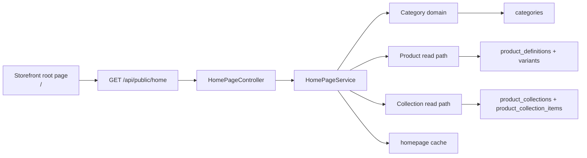
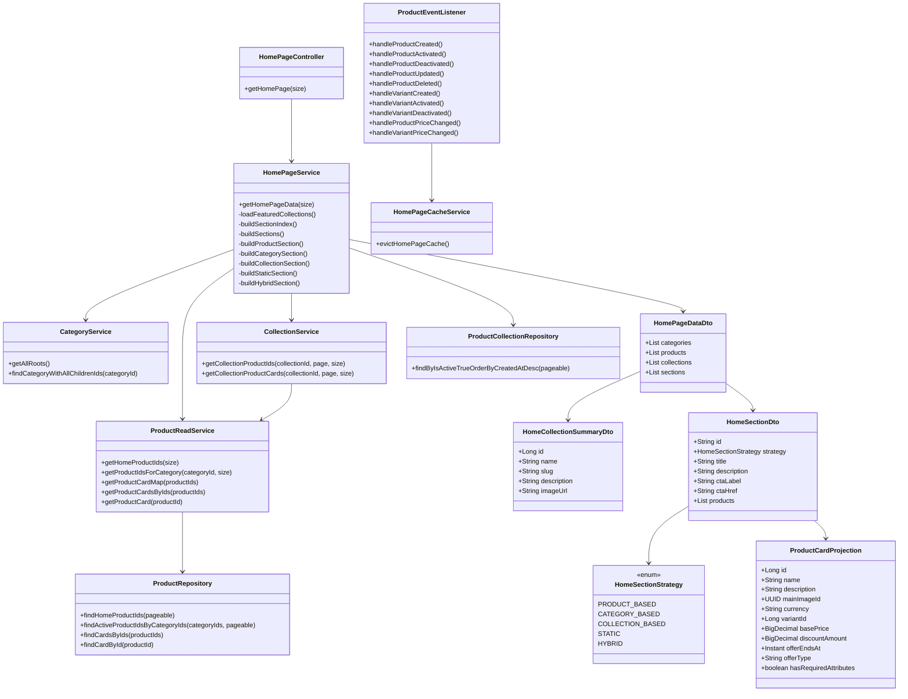
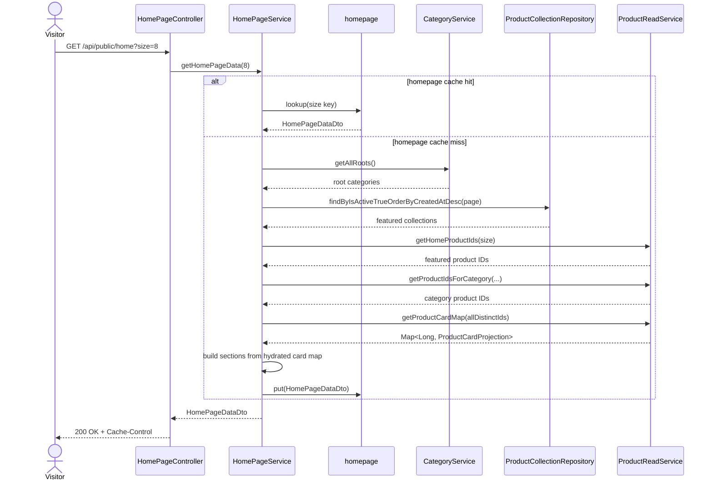
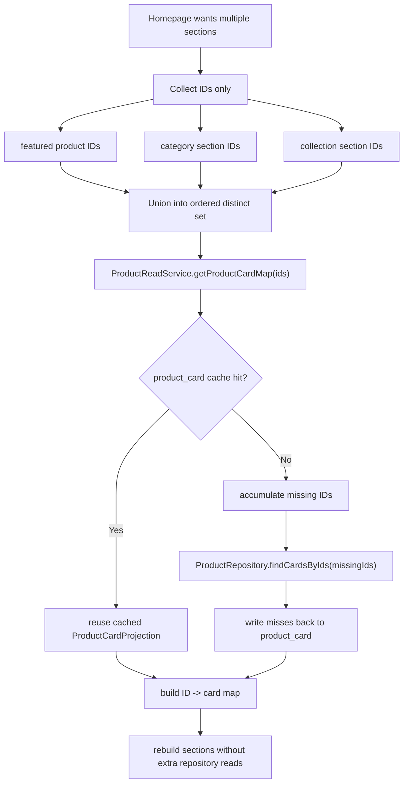
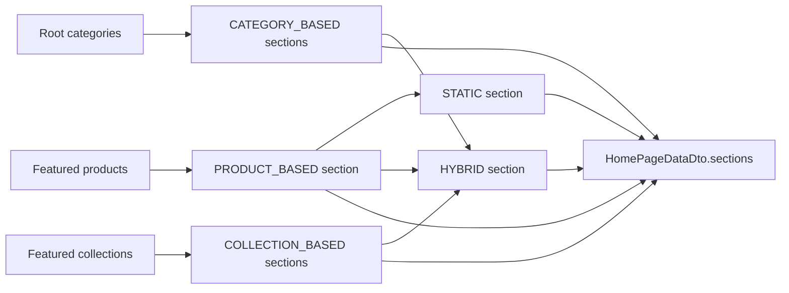
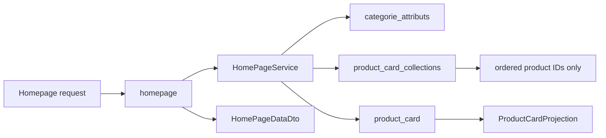
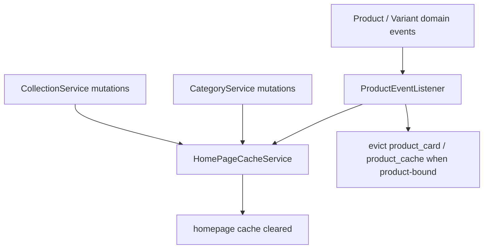
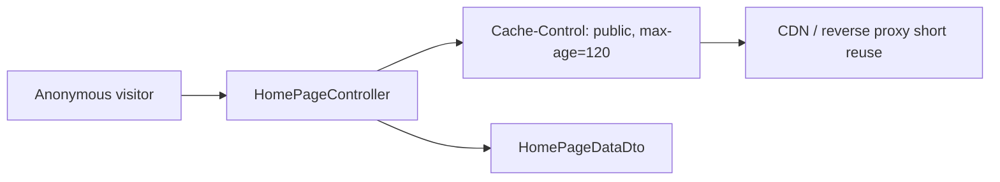
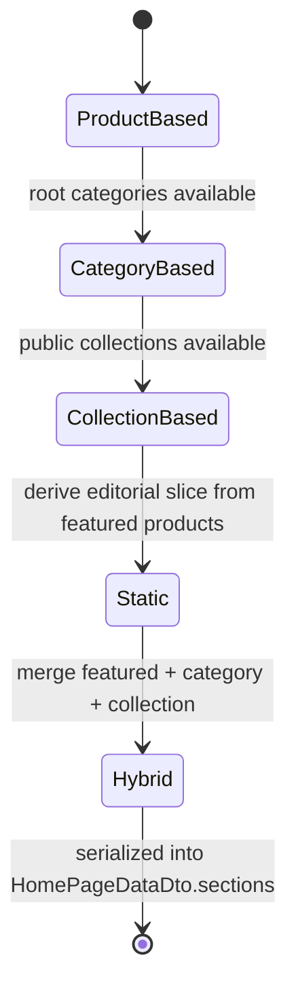
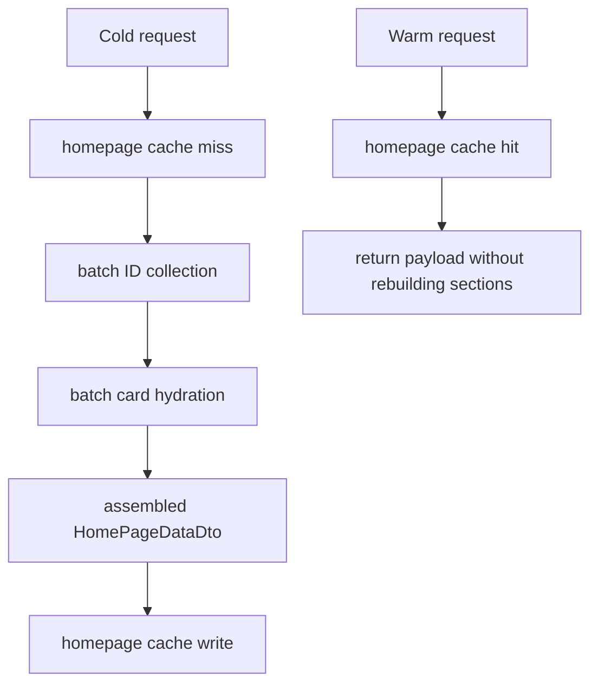

# Homepage UML

## Context And Boundaries

## Class Diagram

## Homepage Read Sequence

## Batch Hydration Pipeline

## Section Assembly Model

## Cache Layer Diagram

## Invalidation Flow

## Public Endpoint Cache Model

## Strategy State View

## Traffic-Oriented Read Model

