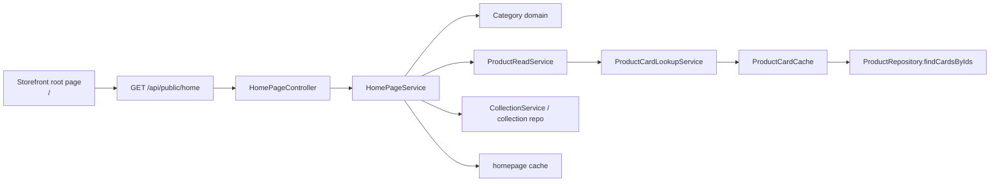
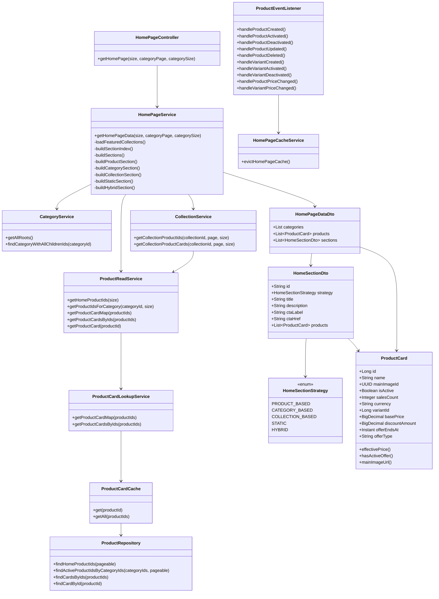
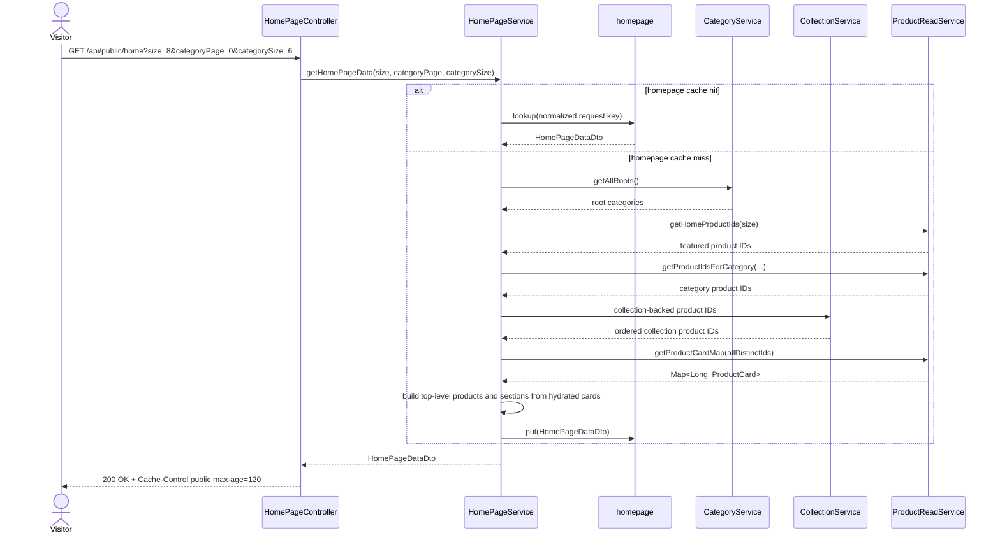
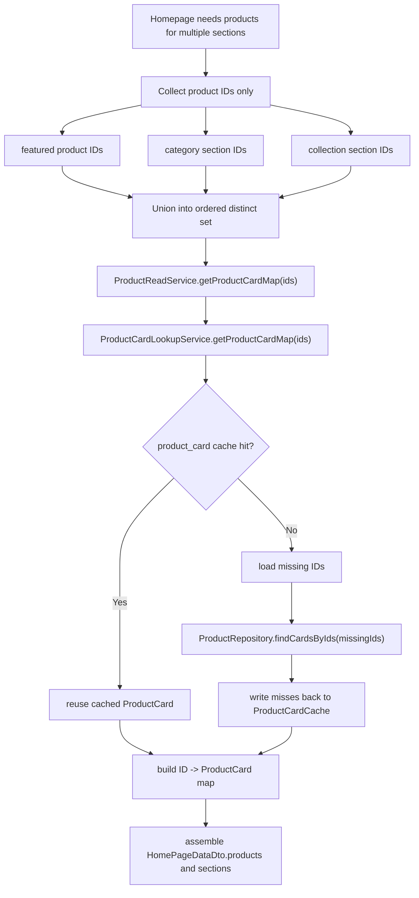
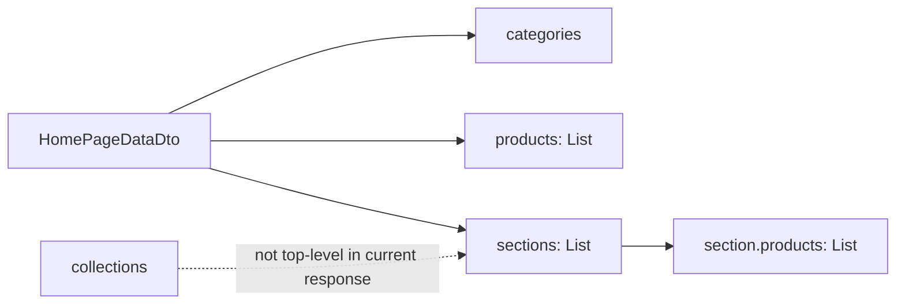
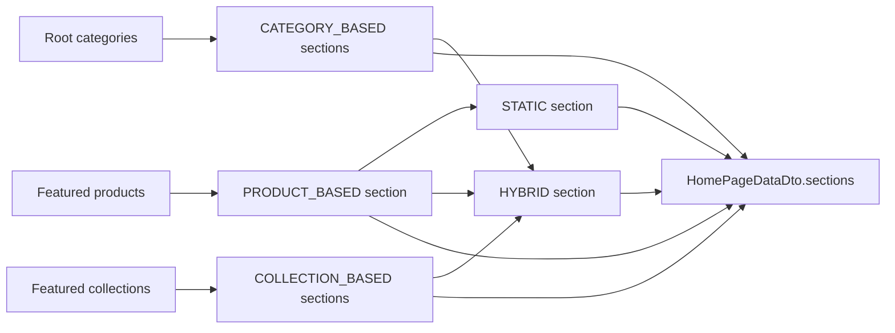
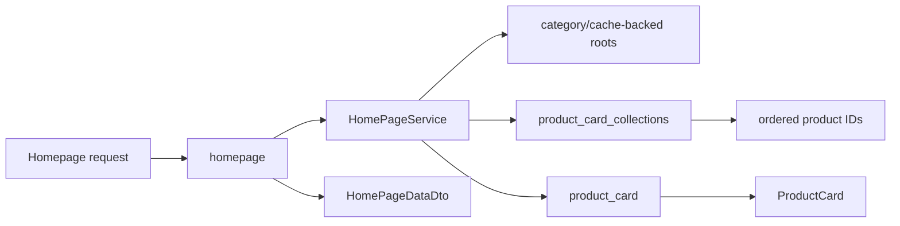
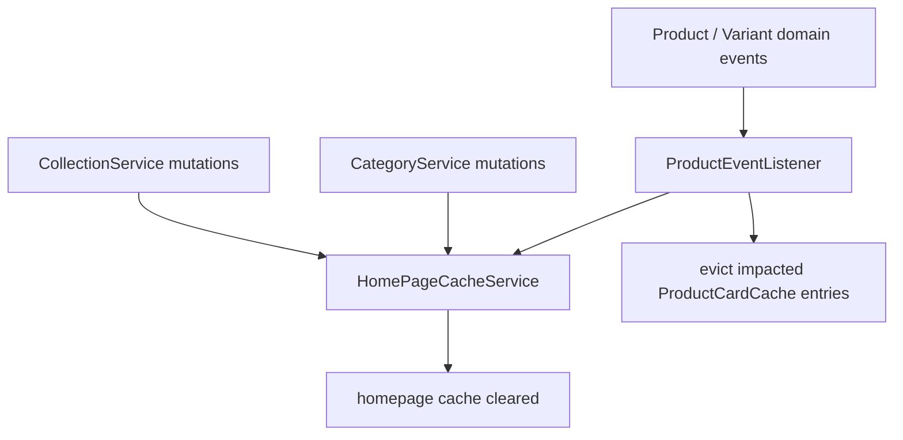
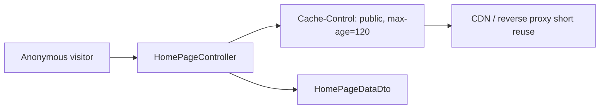

# Homepage UML

## Context And Boundaries

```mermaid
flowchart LR
    Frontend["Storefront root page\n/"] --> Api["GET /api/public/home"]
    Api --> HomeController["HomePageController"]
    HomeController --> HomeService["HomePageService"]

    HomeService --> CategoryDomain["Category domain"]
    HomeService --> ProductRead["ProductReadService"]
    HomeService --> CollectionDomain["CollectionService / collection repo"]
    HomeService --> HomepageCache["homepage cache"]

    ProductRead --> CardLookup["ProductCardLookupService"]
    CardLookup --> CardCache["ProductCardCache"]
    CardCache --> ProductRepo["ProductRepository.findCardsByIds"]
```

## Class Diagram

```mermaid
classDiagram
    class HomePageController {
        +getHomePage(size, categoryPage, categorySize)
    }

    class HomePageService {
        +getHomePageData(size, categoryPage, categorySize)
        -loadFeaturedCollections()
        -buildSectionIndex()
        -buildSections()
        -buildProductSection()
        -buildCategorySection()
        -buildCollectionSection()
        -buildStaticSection()
        -buildHybridSection()
    }

    class HomePageCacheService {
        +evictHomePageCache()
    }

    class HomePageDataDto {
        +List categories
        +List~ProductCard~ products
        +List~HomeSectionDto~ sections
    }

    class HomeSectionDto {
        +String id
        +HomeSectionStrategy strategy
        +String title
        +String description
        +String ctaLabel
        +String ctaHref
        +List~ProductCard~ products
    }

    class HomeSectionStrategy {
        <<enum>>
        PRODUCT_BASED
        CATEGORY_BASED
        COLLECTION_BASED
        STATIC
        HYBRID
    }

    class ProductCard {
        +Long id
        +String name
        +UUID mainImageId
        +Boolean isActive
        +Integer salesCount
        +String currency
        +Long variantId
        +BigDecimal basePrice
        +BigDecimal discountAmount
        +Instant offerEndsAt
        +String offerType
        +effectivePrice()
        +hasActiveOffer()
        +mainImageUrl()
    }

    class ProductReadService {
        +getHomeProductIds(size)
        +getProductIdsForCategory(categoryId, size)
        +getProductCardMap(productIds)
        +getProductCardsByIds(productIds)
        +getProductCard(productId)
    }

    class ProductCardLookupService {
        +getProductCardMap(productIds)
        +getProductCardsByIds(productIds)
    }

    class ProductCardCache {
        +get(productId)
        +getAll(productIds)
    }

    class CollectionService {
        +getCollectionProductIds(collectionId, page, size)
        +getCollectionProductCards(collectionId, page, size)
    }

    class CategoryService {
        +getAllRoots()
        +findCategoryWithAllChildrenIds(categoryId)
    }

    class ProductRepository {
        +findHomeProductIds(pageable)
        +findActiveProductIdsByCategoryIds(categoryIds, pageable)
        +findCardsByIds(productIds)
        +findCardById(productId)
    }

    class ProductEventListener {
        +handleProductCreated()
        +handleProductActivated()
        +handleProductDeactivated()
        +handleProductUpdated()
        +handleProductDeleted()
        +handleVariantCreated()
        +handleVariantActivated()
        +handleVariantDeactivated()
        +handleProductPriceChanged()
        +handleVariantPriceChanged()
    }

    HomePageController --> HomePageService
    HomePageService --> CategoryService
    HomePageService --> ProductReadService
    HomePageService --> CollectionService
    HomePageService --> HomePageDataDto
    HomePageDataDto --> HomeSectionDto
    HomePageDataDto --> ProductCard
    HomeSectionDto --> HomeSectionStrategy
    HomeSectionDto --> ProductCard
    ProductReadService --> ProductCardLookupService
    ProductCardLookupService --> ProductCardCache
    ProductCardCache --> ProductRepository
    CollectionService --> ProductReadService
    ProductEventListener --> HomePageCacheService
```

## Homepage Read Sequence

```mermaid
sequenceDiagram
    actor Visitor
    participant Controller as HomePageController
    participant Service as HomePageService
    participant Cache as homepage
    participant CategoryService
    participant CollectionService
    participant ProductRead as ProductReadService

    Visitor->>Controller: GET /api/public/home?size=8&categoryPage=0&categorySize=6
    Controller->>Service: getHomePageData(size, categoryPage, categorySize)

    alt homepage cache hit
        Service->>Cache: lookup(normalized request key)
        Cache-->>Service: HomePageDataDto
    else homepage cache miss
        Service->>CategoryService: getAllRoots()
        CategoryService-->>Service: root categories
        Service->>ProductRead: getHomeProductIds(size)
        ProductRead-->>Service: featured product IDs
        Service->>ProductRead: getProductIdsForCategory(...)
        ProductRead-->>Service: category product IDs
        Service->>CollectionService: collection-backed product IDs
        CollectionService-->>Service: ordered collection product IDs
        Service->>ProductRead: getProductCardMap(allDistinctIds)
        ProductRead-->>Service: Map<Long, ProductCard>
        Service->>Service: build top-level products and sections from hydrated cards
        Service->>Cache: put(HomePageDataDto)
    end

    Service-->>Controller: HomePageDataDto
    Controller-->>Visitor: 200 OK + Cache-Control public max-age=120
```

## Batch Hydration Pipeline

```mermaid
flowchart TD
    A["Homepage needs products for multiple sections"] --> B["Collect product IDs only"]
    B --> C["featured product IDs"]
    B --> D["category section IDs"]
    B --> E["collection section IDs"]
    C --> F["Union into ordered distinct set"]
    D --> F
    E --> F
    F --> G["ProductReadService.getProductCardMap(ids)"]
    G --> H["ProductCardLookupService.getProductCardMap(ids)"]
    H --> I{"product_card cache hit?"}
    I -- "Yes" --> J["reuse cached ProductCard"]
    I -- "No" --> K["load missing IDs"]
    K --> L["ProductRepository.findCardsByIds(missingIds)"]
    L --> M["write misses back to ProductCardCache"]
    J --> N["build ID -> ProductCard map"]
    M --> N
    N --> O["assemble HomePageDataDto.products and sections"]
```

## Response Shape

```mermaid
flowchart LR
    Home["HomePageDataDto"] --> Categories["categories"]
    Home --> Products["products: List<ProductCard>"]
    Home --> Sections["sections: List<HomeSectionDto>"]
    Sections --> SectionProducts["section.products: List<ProductCard>"]

    Collections["collections"] -. "not top-level in current response" .-> Sections
```

## Section Assembly Model

```mermaid
flowchart LR
    A["Root categories"] --> B["CATEGORY_BASED sections"]
    C["Featured products"] --> D["PRODUCT_BASED section"]
    E["Featured collections"] --> F["COLLECTION_BASED sections"]
    D --> G["STATIC section"]
    D --> H["HYBRID section"]
    B --> H
    F --> H
    B --> I["HomePageDataDto.sections"]
    D --> I
    F --> I
    G --> I
    H --> I
```

## Cache Layer Diagram

```mermaid
flowchart LR
    HomeReq["Homepage request"] --> HomeCache["homepage"]
    HomeCache --> HomeService["HomePageService"]

    HomeService --> CategoryCache["category/cache-backed roots"]
    HomeService --> CollectionCache["product_card_collections"]
    HomeService --> CardCache["product_card"]

    CollectionCache --> CollectionIds["ordered product IDs"]
    CardCache --> ProductCards["ProductCard"]
    HomeCache --> HomePayload["HomePageDataDto"]
```

## Invalidation Flow

```mermaid
flowchart TD
    ProductEvents["Product / Variant domain events"] --> ProductListener["ProductEventListener"]
    CollectionWrites["CollectionService mutations"] --> HomepageInvalidation["HomePageCacheService"]
    CategoryWrites["CategoryService mutations"] --> HomepageInvalidation

    ProductListener --> ProductCardEvict["evict impacted ProductCardCache entries"]
    ProductListener --> HomepageInvalidation

    HomepageInvalidation --> HomeCache["homepage cache cleared"]
```

## Public Endpoint Cache Model

```mermaid
flowchart LR
    Client["Anonymous visitor"] --> Controller["HomePageController"]
    Controller --> Headers["Cache-Control: public, max-age=120"]
    Headers --> Edge["CDN / reverse proxy short reuse"]
    Controller --> Payload["HomePageDataDto"]
```
