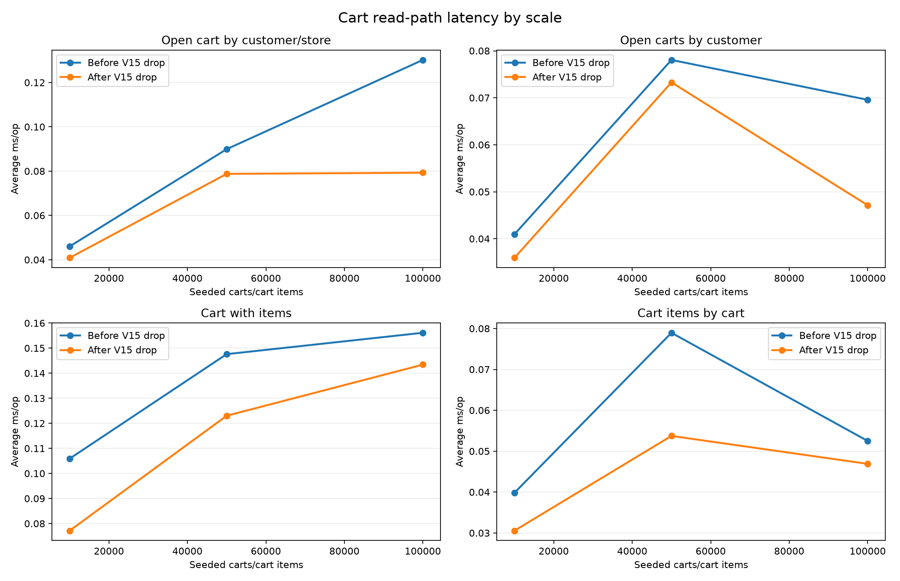
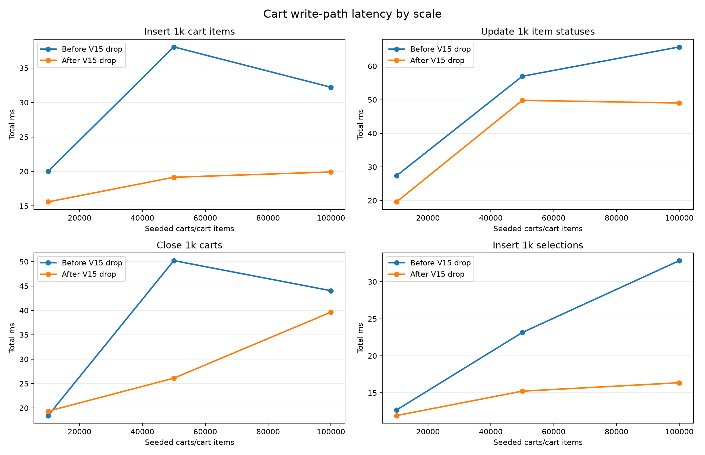
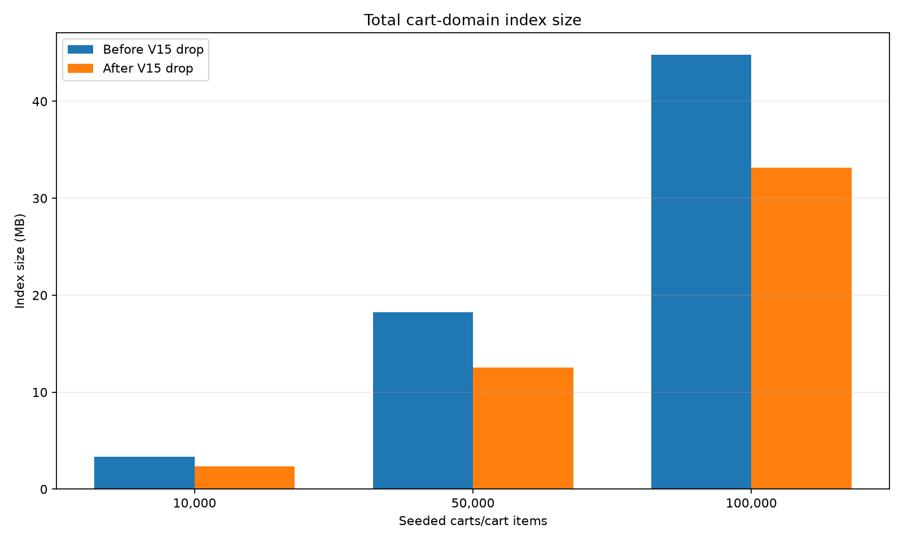
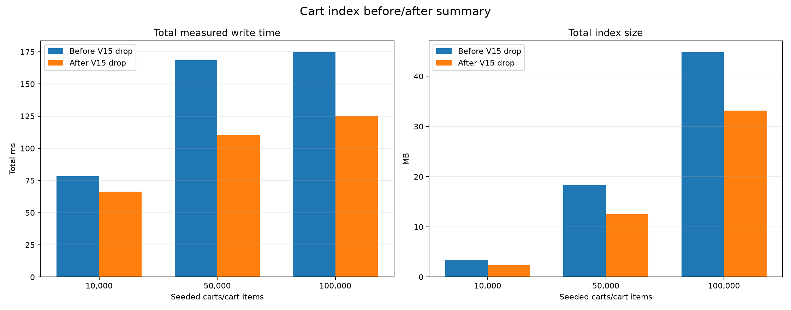

# Cart Index Before/After Benchmark

This load-testing artifact documents why `V15__drop_redundant_cart_indexes.sql` removes several cart indexes after `V14__unique_open_cart_index.sql`.

The benchmark is direct PostgreSQL SQL. It does not use the API, the storefront, or JMeter.

## Story

`V6__cart_orders_checkout.sql` created broad indexes for the cart tables:

- `carts`: customer, store, customer/store open-cart lookup, and customer-open lookup.
- `cart_items`: cart, variant, status, cart/status, and active-cart partial lookup.
- `cart_item_selections`: two identical indexes on `cart_item_id`.

`V14__unique_open_cart_index.sql` made `idx_cart_customer_store_open` unique:

```sql
CREATE UNIQUE INDEX idx_cart_customer_store_open
    ON carts(customer_id, store_id)
    WHERE closed = false;
```

That index does two jobs:

- Enforces one open cart per customer/store.
- Covers the hot open-cart lookup by `customer_id`, `store_id`, and `closed = false`.

`V15__drop_redundant_cart_indexes.sql` then removes indexes that add write cost but do not serve the current repository hot paths:

- `idx_cart_customer_open`
- `idx_cart_item_status`
- `idx_cart_item_cart_status`
- `idx_cart_item_cart_active`
- `idx_cart_item_selection_active`

The benchmark recreates the V14-before-drop state, measures it, applies the V15 drops, measures again, and leaves the database in the V15 state.

## Public Artifacts

The benchmark was run against a local PostgreSQL copy of the private schema. This public repository keeps the benchmark story and generated result artifacts, not the private runnable database setup.

## Data Shape

The script runs three scales:

| Scale | Carts | Cart items | Cart item selections |
| --- | ---: | ---: | ---: |
| 10k | 10,000 | 10,000 | 10,000 |
| 50k | 50,000 | 50,000 | 50,000 |
| 100k | 100,000 | 100,000 | 100,000 |

For each scale, the script creates temporary benchmark customers, seller, store, product, variant, carts, cart items, and selections. Benchmark rows use `cart-index-bench-*` names/slugs and `cb000000-*` UUIDs, then are cleaned up after each scale.

## Measured Scenarios

Read scenarios:

- Open cart by `customer_id + store_id + closed=false`.
- Open carts by customer.
- Cart with items by cart id/customer.
- Cart items by cart id.

Write scenarios:

- Insert `1,000` cart items.
- Update `1,000` cart item statuses.
- Close `1,000` carts.
- Insert `1,000` cart item selections.

Size scenarios:

- Per-index size for `carts`, `cart_items`, and `cart_item_selections`.
- Total cart-domain index size before and after the V15 drop.

## Cart Controller Read Impact

The dropped V15 indexes should not hurt the cart controller read methods because their query shapes are still covered by retained indexes.

| Controller method | Endpoint | Main service/repository path | Index effect |
| --- | --- | --- | --- |
| `getMyAllCarts` | `GET /api/cart/my` | `getAllCustomerCarts` -> `findAllWithItemsByCustomerIdAndClosedFalse` | `idx_cart_customer_open` is dropped, but `idx_cart_customer_store_open` can still serve `customer_id + closed=false` through its leading `customer_id` column. Item loading still uses retained `idx_cart_item_cart`. |
| `getMyCartSummaries` | `GET /api/cart/my/summary` | `getAllCustomerCartSummaries` -> `findAllWithItemsByCustomerIdAndClosedFalse` | Same cart lookup as `getMyAllCarts`; live variant summary queries are outside the cart index change. |
| `getMyCartByStore` | `GET /api/cart/my/{storeId}` | `getCartWithValidation` -> `findWithItemsByCustomerIdAndStoreIdAndClosedFalse` | Exact match on retained unique `idx_cart_customer_store_open`; this is the strongest covered read path. |
| `getMyCartById` | `GET /api/cart/my/cart/{cartId}` | `getCartById` -> `findWithItemsByIdAndCustomerIdAndClosedFalse` | Starts from the `carts` primary key, then loads items through retained `idx_cart_item_cart`; none of the dropped indexes are required. |
| `getMyCartSummary` | `GET /api/cart/my/cart/{cartId}/summary` | `getCartSummary` -> `findByIdAndCustomerIdAndClosedFalse` | Uses the `carts` primary key for cart ownership/open-state check; item and variant summary work does not depend on the dropped cart item status indexes. |

The important negative check is what the controller does not do: no read endpoint filters cart items by `status`, and no read endpoint needs both `idx_cart_item_selection_cart_item` and the duplicate `idx_cart_item_selection_active`. That is why V15 can remove status-oriented and duplicate selection indexes while keeping the read methods covered.

## Outputs

- `results/read-latency-by-scale.png`
- `results/write-latency-by-scale.png`
- `results/index-size-by-scale.png`
- `results/before-after-summary.png`
- `results/cart-index-benchmark-summary.md`

Review the generated summary:

[Generated benchmark summary](results/cart-index-benchmark-summary.md)

Generated charts:









## Expected Interpretation

The read hot paths should remain stable because V15 keeps:

- `idx_cart_customer_store_open`
- `idx_cart_store`
- `idx_cart_item_cart`
- `idx_cart_item_variant`
- `idx_cart_item_selection_cart_item`

The write paths should improve as the table grows because V15 removes redundant maintenance work on every cart item insert, status update, cart close/open transition, and cart item selection insert.

The index-size chart should show the most obvious win: V15 stores fewer duplicate or unused B-tree structures for the same cart workload.
